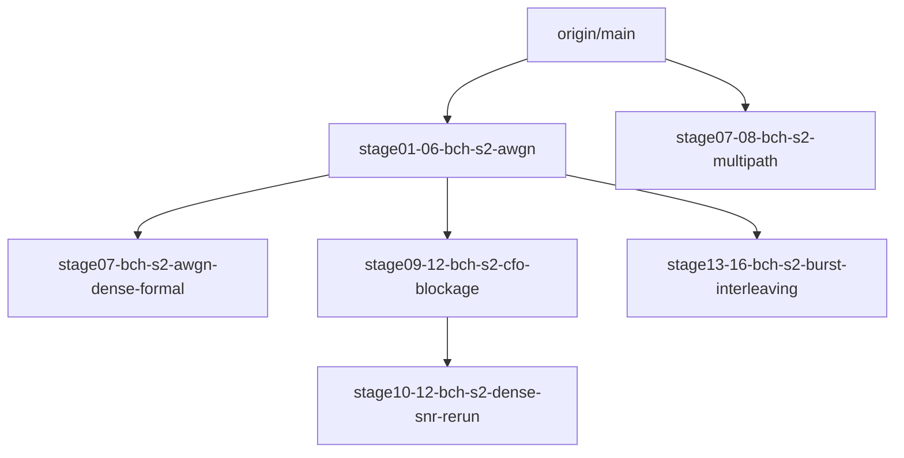

# Stage17 BCH S2 Integration Dependency Graph

| A | B | A ancestor of B | B ancestor of A |
|---|---|---|---|
| `stage01-06-bch-s2-awgn` | `stage07-bch-s2-awgn-dense-formal` | TRUE | FALSE |
| `stage01-06-bch-s2-awgn` | `stage09-12-bch-s2-cfo-blockage` | TRUE | FALSE |
| `stage09-12-bch-s2-cfo-blockage` | `stage10-12-bch-s2-dense-snr-rerun` | TRUE | FALSE |
| `stage01-06-bch-s2-awgn` | `stage13-16-bch-s2-burst-interleaving` | TRUE | FALSE |
| `stage01-06-bch-s2-awgn` | `stage07-08-bch-s2-multipath` | FALSE | FALSE |
| `stage07-bch-s2-awgn-dense-formal` | `stage07-08-bch-s2-multipath` | FALSE | FALSE |
| `stage07-bch-s2-awgn-dense-formal` | `stage10-12-bch-s2-dense-snr-rerun` | FALSE | FALSE |
| `stage09-12-bch-s2-cfo-blockage` | `stage13-16-bch-s2-burst-interleaving` | FALSE | FALSE |
