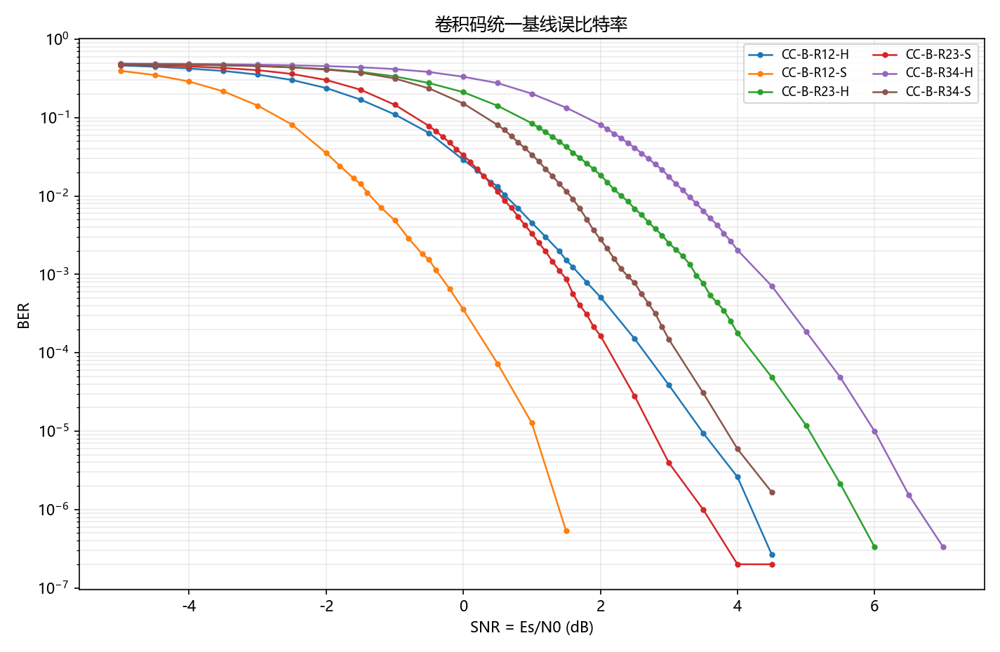
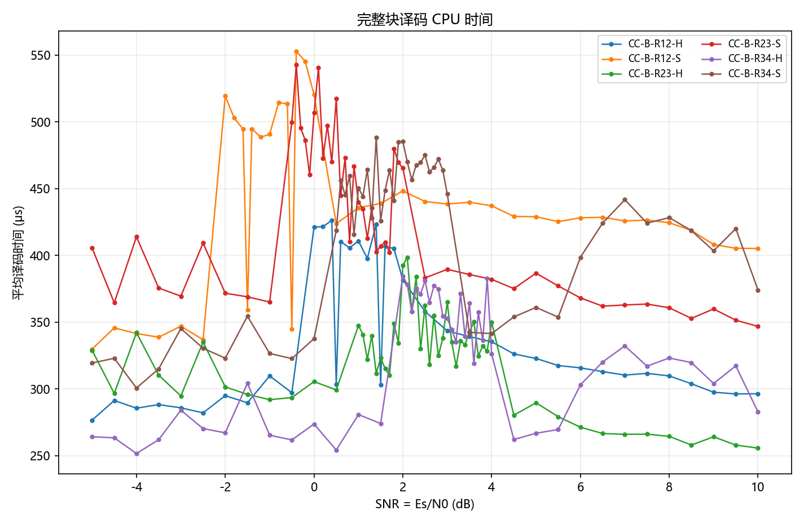
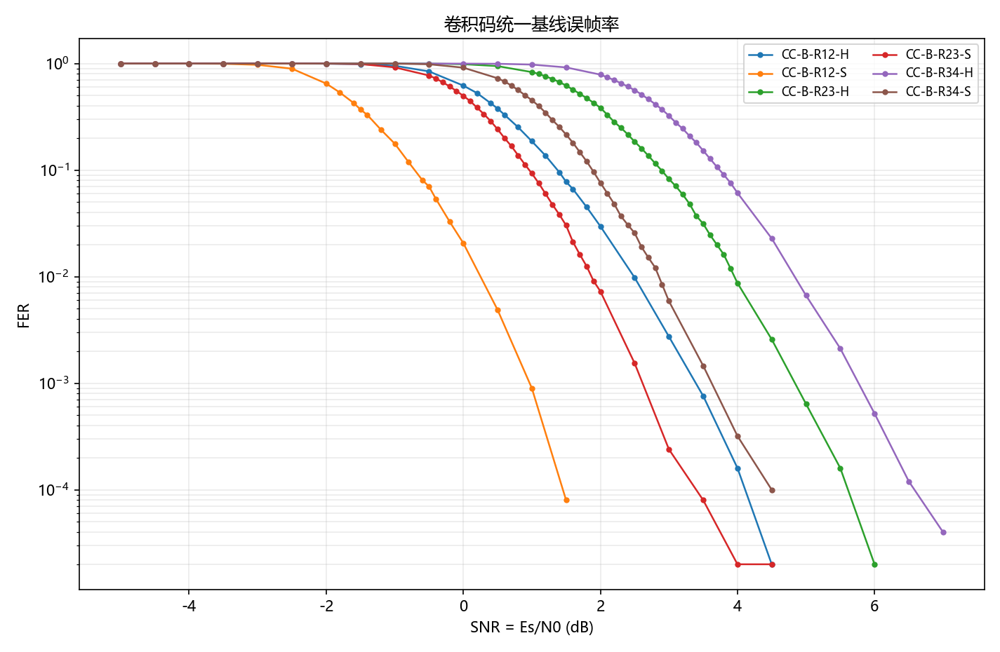
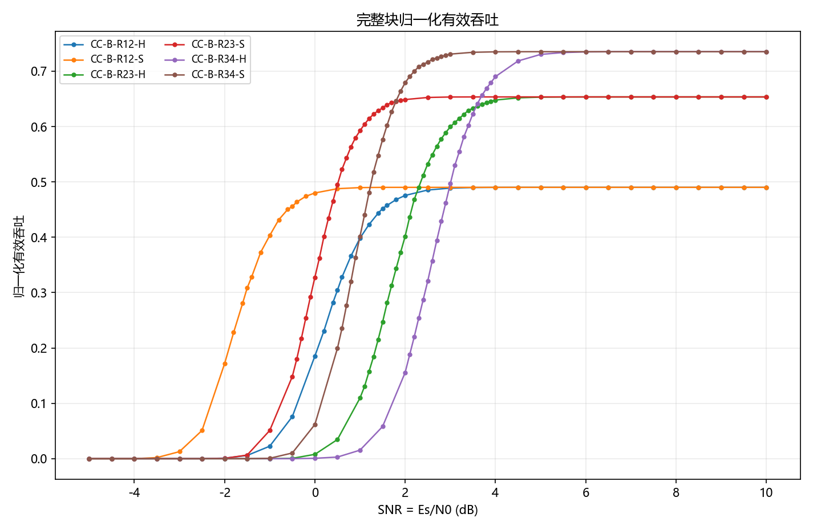
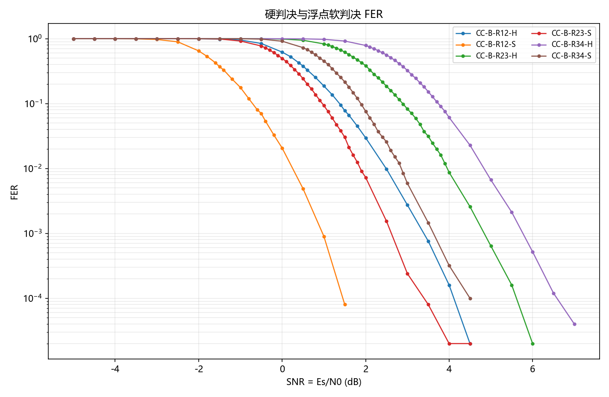

# Stage09 整块编码正式基线 results 分析

## 1. 阶段实验目的
支撑 CC S3 300 bit 高速电文正式评估，输出可追溯的性能和资源数据。

## 2. 本轮正式配置
SNR = Es/N0，-5.0 dB 到 10.0 dB，步长 0.5 dB；minFrames=1000，targetFrameErrors=200，maxFrames=50000。

## 3. 仿真规模
正式结果行数 282，累计帧数 5295134，配置组合数 6。

## 4. 数据完整性检查
本轮结果由脚本从正式 CSV 和 runtime shard 生成，未手工修改 BER/FER，未用空图作为 PASS。

## 5. 主要现象
两层正式基线含粗网格和补充密集点；本轮作为整块参考输入 Stage15。

## 6. 结果图

### stage09_two_level_ber.png

对应 figure-data：未单独生成。

### stage09_two_level_delay.png

对应 figure-data：未单独生成。

### stage09_two_level_fer.png

对应 figure-data：未单独生成。

### stage09_two_level_goodput.png

对应 figure-data：未单独生成。

### stage09_two_level_hard_soft_fer.png

对应 figure-data：未单独生成。

## 7. 限制
CPU 时间依赖当前硬件和进程并行状态；零误码点只代表有限帧数下的上界，不代表理论误码平台。