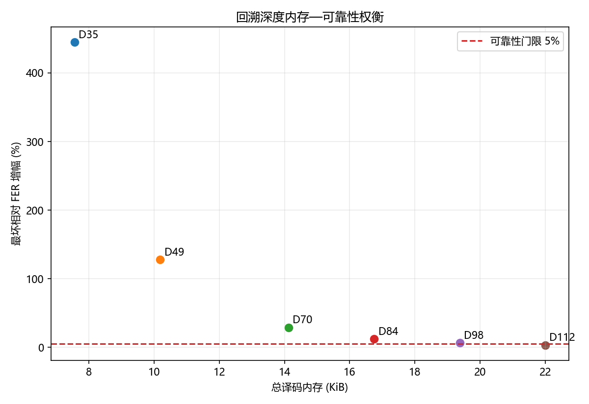
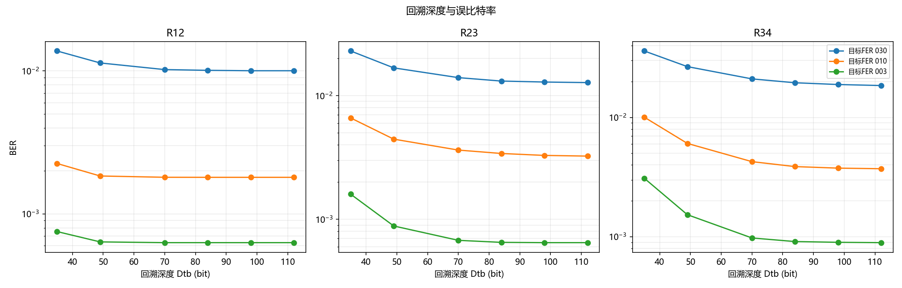
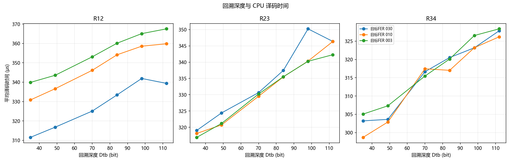
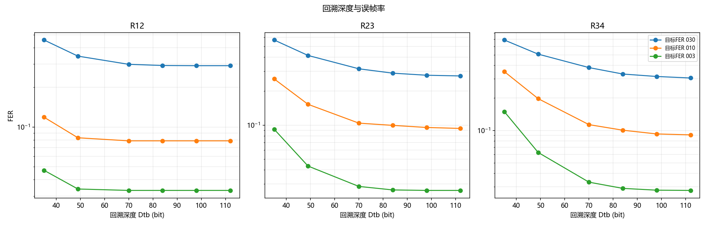
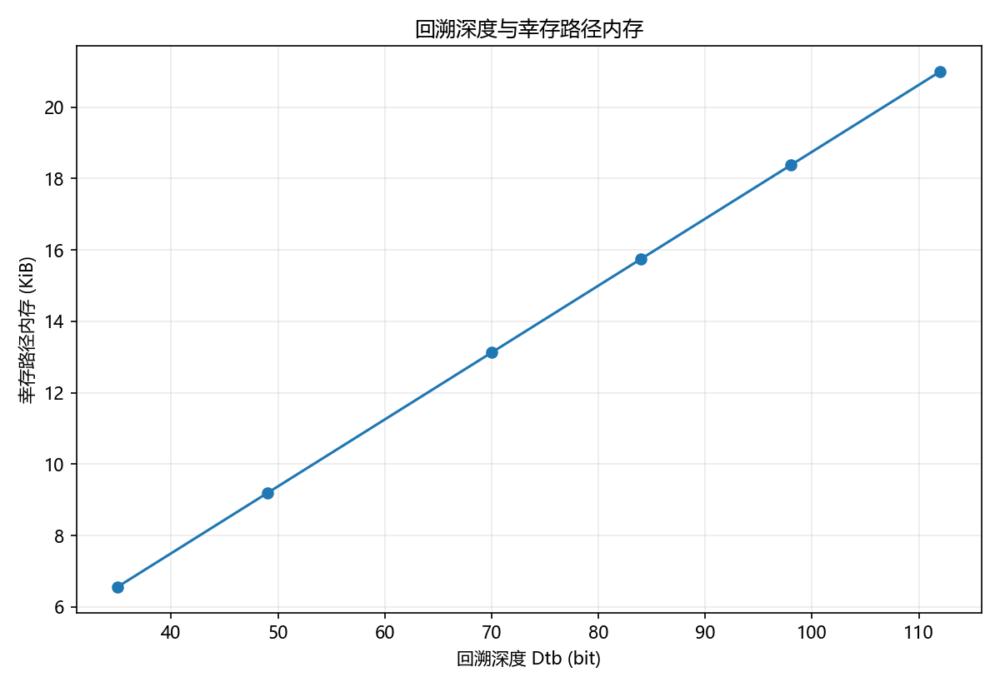
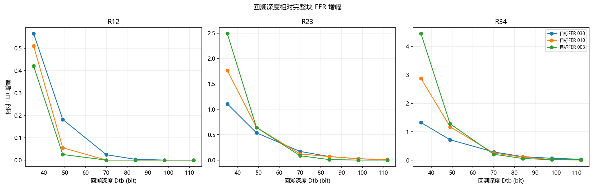

# Stage10 有限回溯复核 results 分析

## 1. 阶段实验目的
支撑 CC S3 300 bit 高速电文正式评估，输出可追溯的性能和资源数据。

## 2. 本轮正式配置
SNR = Es/N0，-5.0 dB 到 10.0 dB，步长 0.5 dB；minFrames=1000，targetFrameErrors=200，maxFrames=50000。

## 3. 仿真规模
正式结果行数 63，累计帧数 215831，配置组合数 21。

## 4. 数据完整性检查
本轮结果由脚本从正式 CSV 和 runtime shard 生成，未手工修改 BER/FER，未用空图作为 PASS。

## 5. 主要现象
Dtb=35/49/70/84/98/112 的有限回溯数据继续用于内存-可靠性权衡。

## 6. 结果图

### stage10_memory_reliability_tradeoff.png

对应 figure-data：stage10_memory_reliability_tradeoff_figure_data.csv。

### stage10_traceback_ber.png

对应 figure-data：stage10_traceback_ber_figure_data.csv。

### stage10_traceback_cpu_latency.png

对应 figure-data：stage10_traceback_cpu_latency_figure_data.csv。

### stage10_traceback_fer.png

对应 figure-data：stage10_traceback_fer_figure_data.csv。

### stage10_traceback_memory.png

对应 figure-data：stage10_traceback_memory_figure_data.csv。

### stage10_traceback_relative_fer_loss.png

对应 figure-data：stage10_traceback_relative_fer_loss_figure_data.csv。

## 7. 限制
CPU 时间依赖当前硬件和进程并行状态；零误码点只代表有限帧数下的上界，不代表理论误码平台。