# Stage13 真滑窗 W/S/D 控制变量正式实验 results 分析

## 1. 阶段实验目的
支撑 CC S3 300 bit 高速电文正式评估，输出可追溯的性能和资源数据。

## 2. 本轮正式配置
SNR = Es/N0，-5.0 dB 到 10.0 dB，步长 0.5 dB；minFrames=1000，targetFrameErrors=200，maxFrames=50000。

## 3. 仿真规模
正式结果行数 1302，累计帧数 36789382，配置组合数 36。

## 4. 数据完整性检查
本轮结果由脚本从正式 CSV 和 runtime shard 生成，未手工修改 BER/FER，未用空图作为 PASS。

## 5. 主要现象
本轮新增 full W/S/D 正式网格：CONTROL_W=372 点、CONTROL_S=372 点、CONTROL_D=558 点。

## 6. 结果图

### stage13_control_d_ber_fer.png
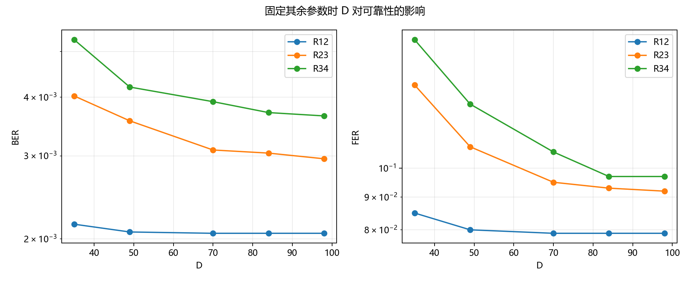
对应 figure-data：stage13_control_d_ber_fer.csv。

### stage13_control_s_ber_fer.png
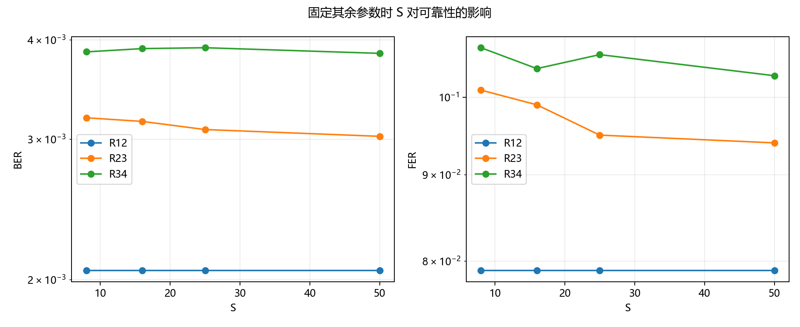
对应 figure-data：stage13_control_s_ber_fer.csv。

### stage13_control_w_ber_fer.png
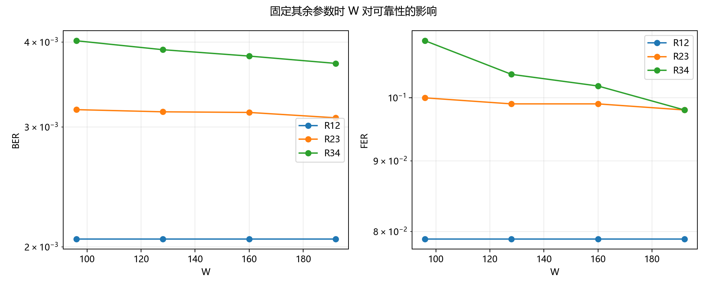
对应 figure-data：stage13_control_w_ber_fer.csv。

### stage13_d_traceback_operations.png

对应 figure-data：stage13_d_traceback_operations.csv。

### stage13_delay_reliability_pareto.png
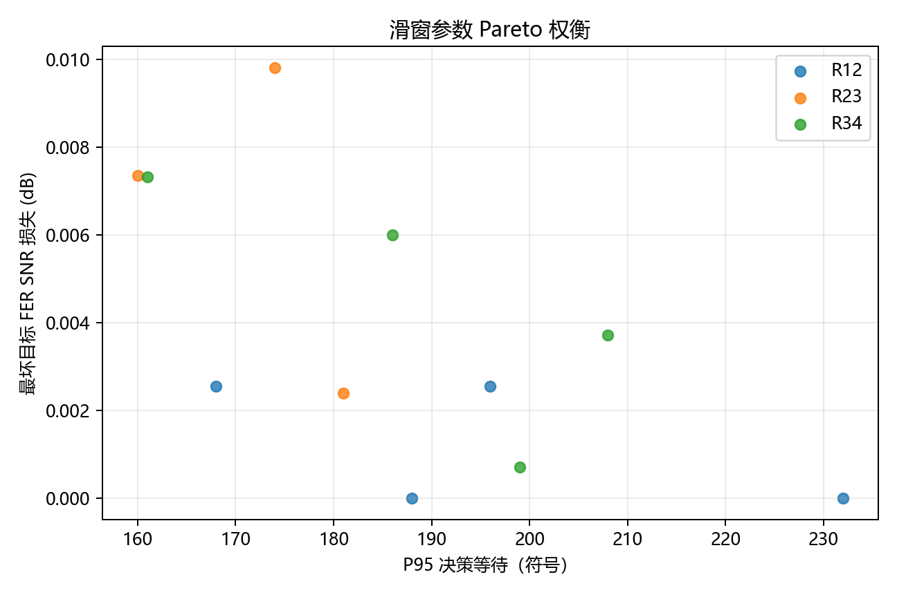
对应 figure-data：stage13_delay_reliability_pareto.csv。

### stage13_final_ber_comparison.png
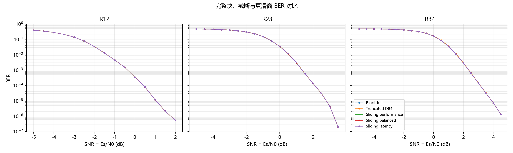
对应 figure-data：stage13_final_ber_comparison.csv。

### stage13_final_complexity_comparison.png
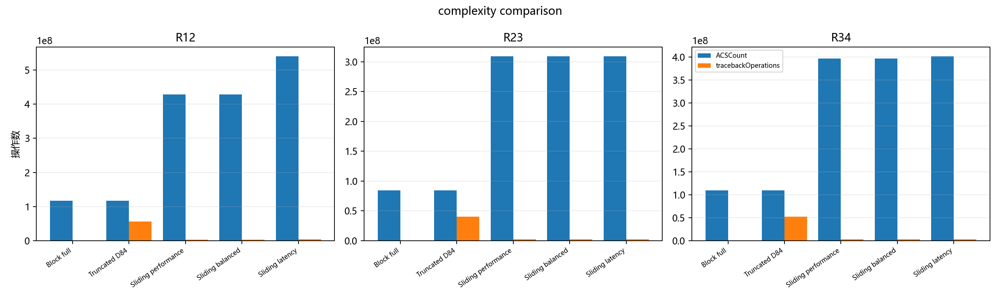
对应 figure-data：stage13_final_complexity_comparison.csv。

### stage13_final_fer_comparison.png
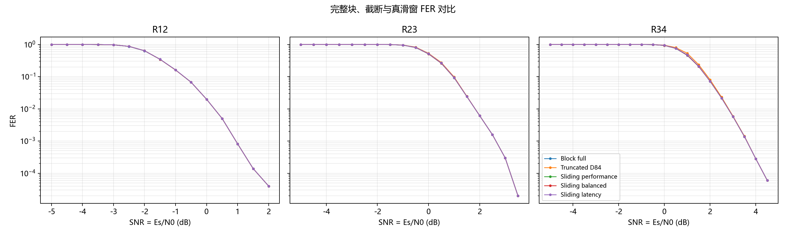
对应 figure-data：stage13_final_fer_comparison.csv。

### stage13_final_latency_comparison.png
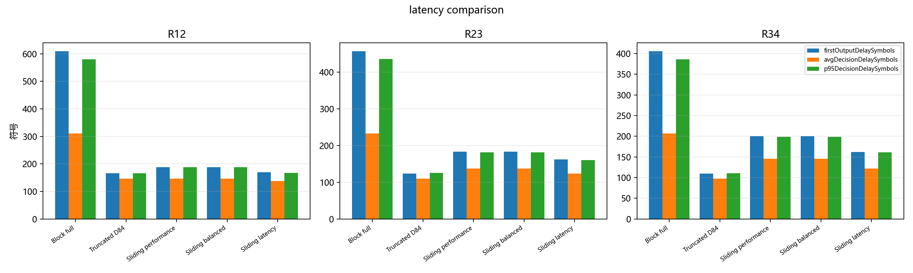
对应 figure-data：stage13_final_latency_comparison.csv。

### stage13_final_memory_comparison.png
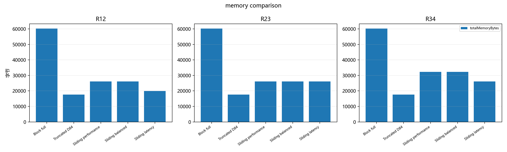
对应 figure-data：stage13_final_memory_comparison.csv。

### stage13_memory_reliability_pareto.png
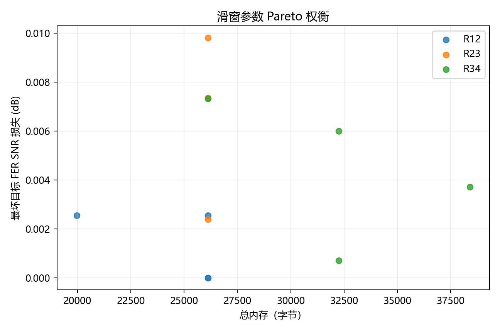
对应 figure-data：stage13_memory_reliability_pareto.csv。

### stage13_mismatch_heatmap.png
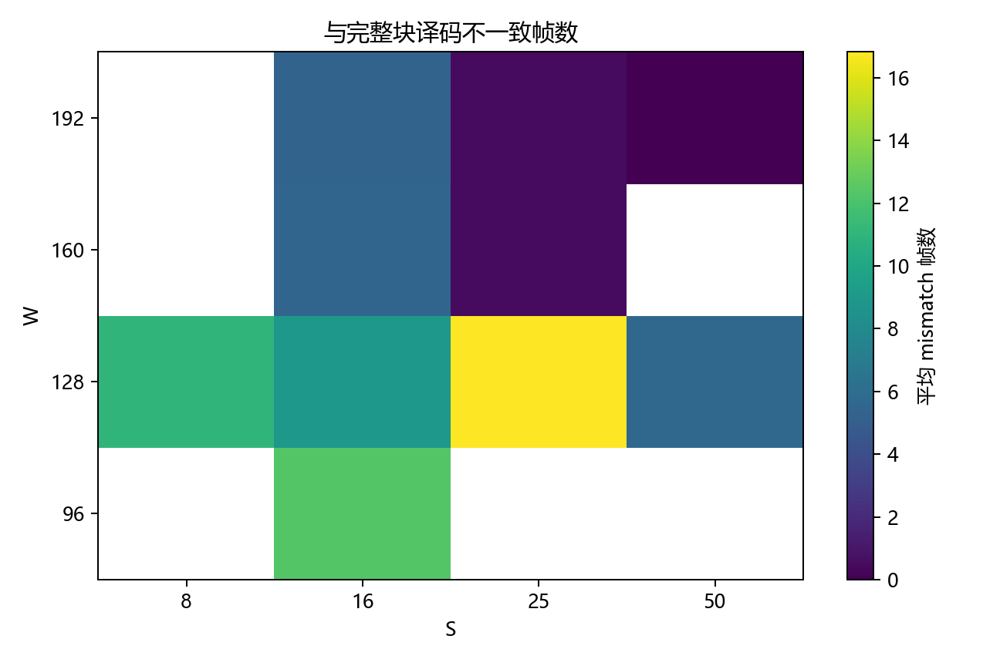
对应 figure-data：stage13_mismatch_heatmap.csv。

### stage13_r12_dtb_fer_snr.png

对应 figure-data：stage13_r12_dtb_fer_snr.csv。

### stage13_r12_slidebits_fer_snr.png

对应 figure-data：stage13_r12_slidebits_fer_snr.csv。

### stage13_r12_windowbits_fer_snr.png

对应 figure-data：stage13_r12_windowbits_fer_snr.csv。

### stage13_r23_dtb_fer_snr.png

对应 figure-data：stage13_r23_dtb_fer_snr.csv。

### stage13_r23_slidebits_fer_snr.png

对应 figure-data：stage13_r23_slidebits_fer_snr.csv。

### stage13_r23_windowbits_fer_snr.png

对应 figure-data：stage13_r23_windowbits_fer_snr.csv。

### stage13_r34_dtb_fer_snr.png

对应 figure-data：stage13_r34_dtb_fer_snr.csv。

### stage13_r34_slidebits_fer_snr.png

对应 figure-data：stage13_r34_slidebits_fer_snr.csv。

### stage13_r34_windowbits_fer_snr.png

对应 figure-data：stage13_r34_windowbits_fer_snr.csv。

### stage13_s_avg_p95_latency.png

对应 figure-data：stage13_s_avg_p95_latency.csv。

### stage13_s_steady_output_interval.png
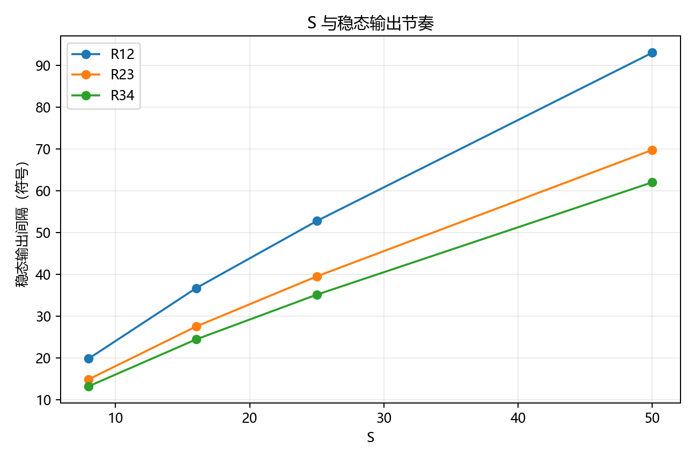
对应 figure-data：stage13_s_steady_output_interval.csv。

### stage13_w_actual_memory.png
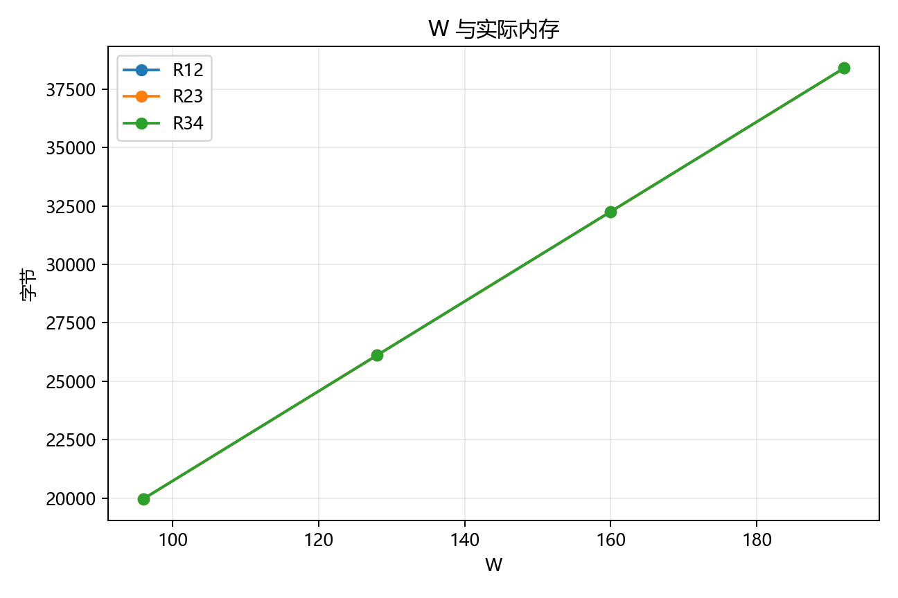
对应 figure-data：stage13_w_actual_memory.csv。

## 7. 限制
CPU 时间依赖当前硬件和进程并行状态；零误码点只代表有限帧数下的上界，不代表理论误码平台。