# Stage13 全量 W/S/D 控制变量正式实验结果

本轮从 `revision_20260730_full_wsd` 的 8 个 shard 合并得到 1302 行正式数据。
仿真范围为 SNR = Es/N0 -5.0 dB 到 10.0 dB，步长 0.5 dB；每点 minFrames=1000、targetFrameErrors=200、maxFrames=50000。

## 数据规模

- CONTROL_W: 372 点，总帧数 10511252，总误帧 128769。
- CONTROL_S: 372 点，总帧数 10511252，总误帧 128504。
- CONTROL_D: 558 点，总帧数 15766878，总误帧 194892。

## 结果图

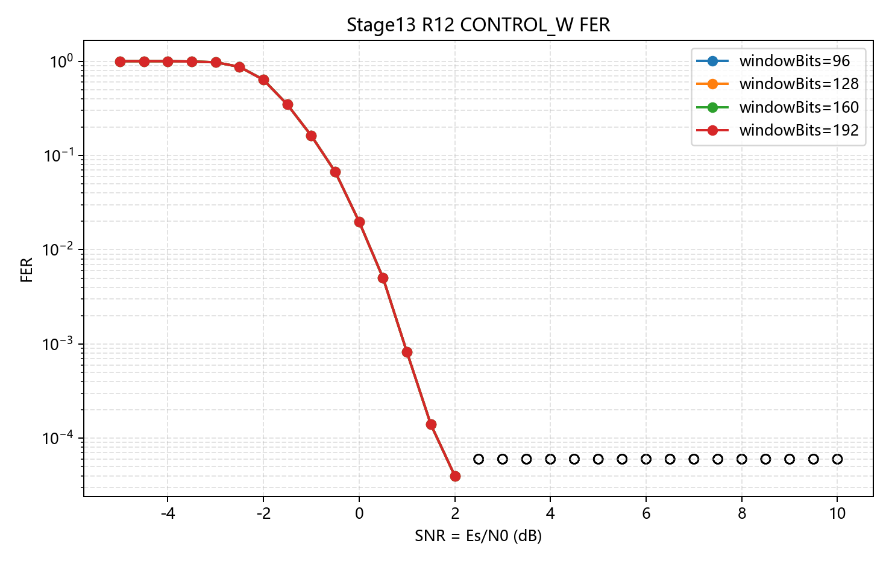

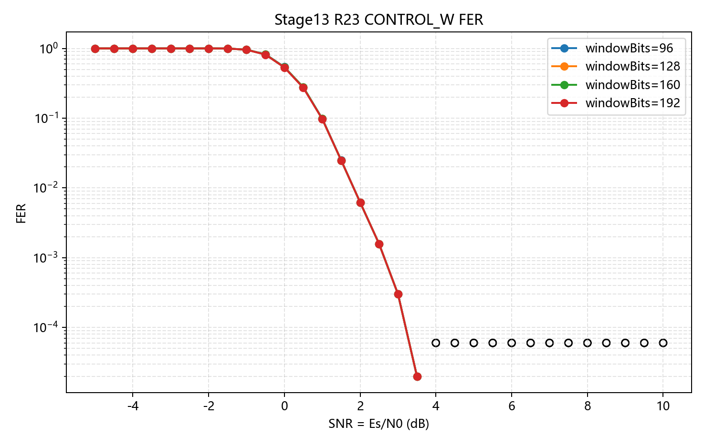

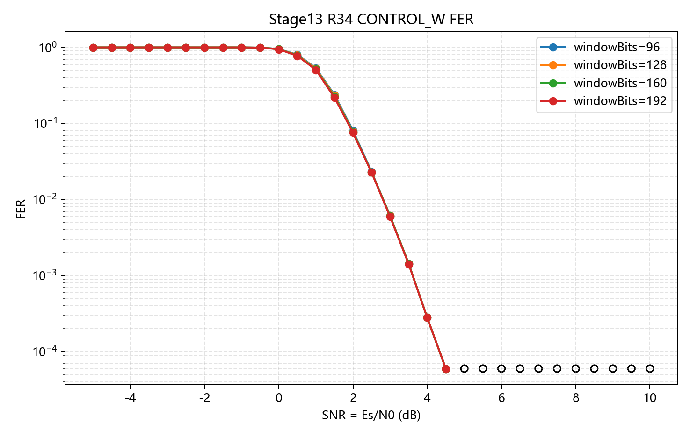

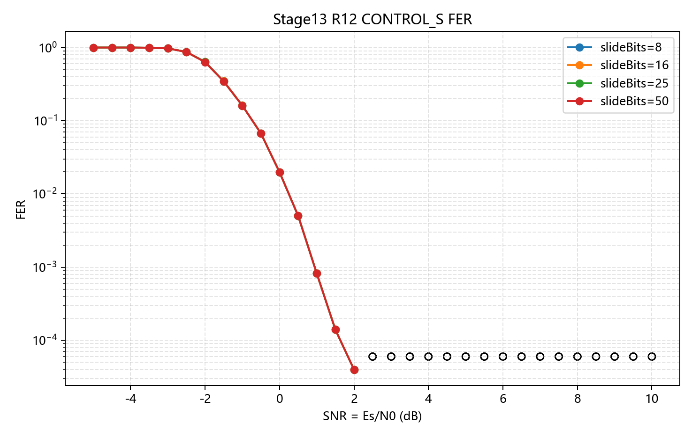

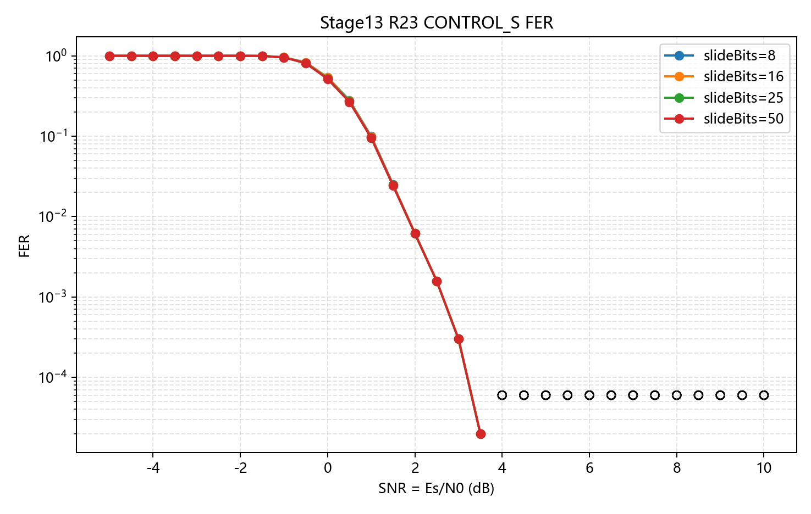

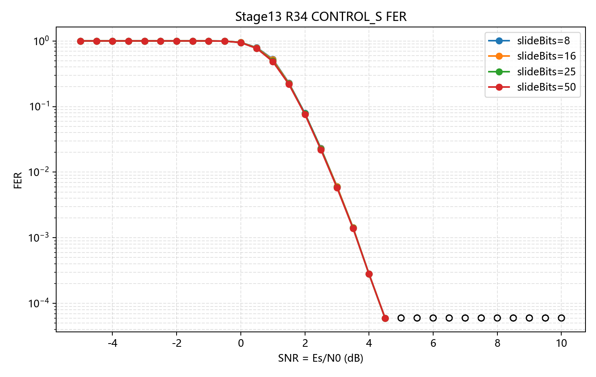

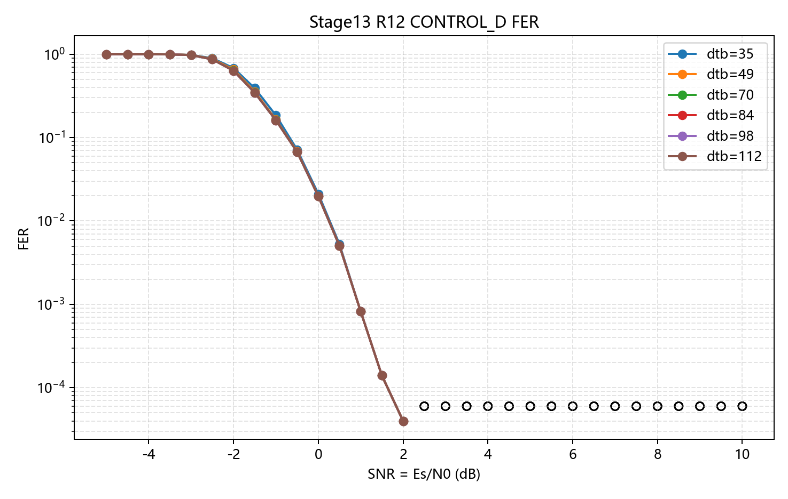

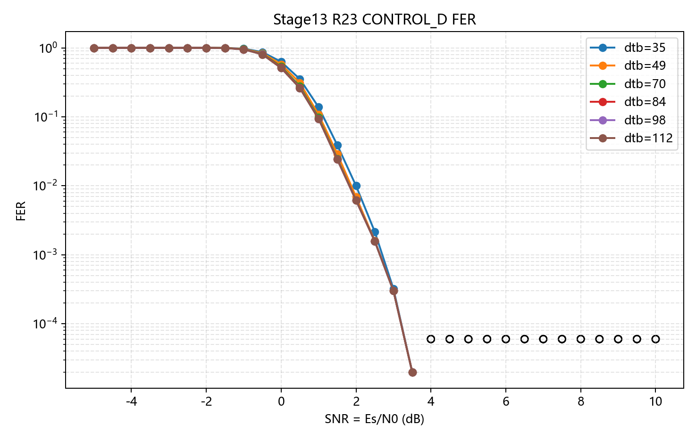

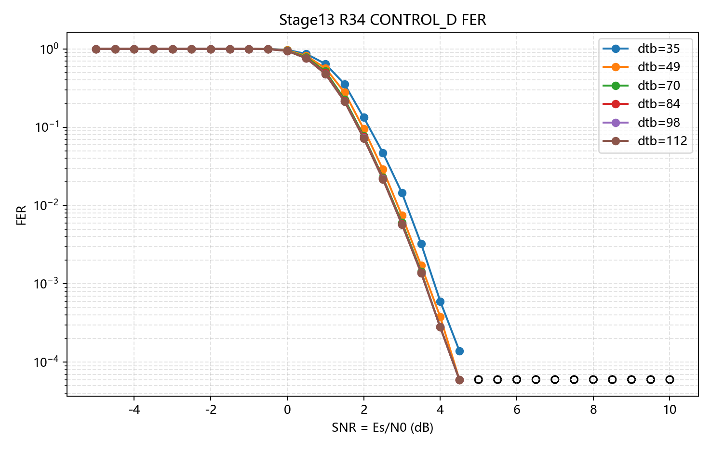

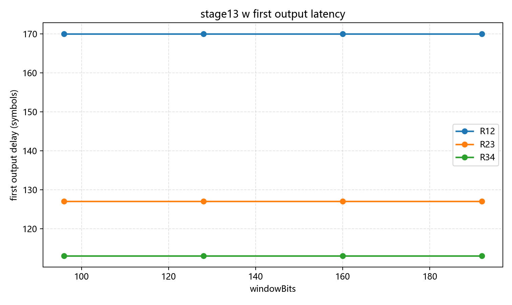

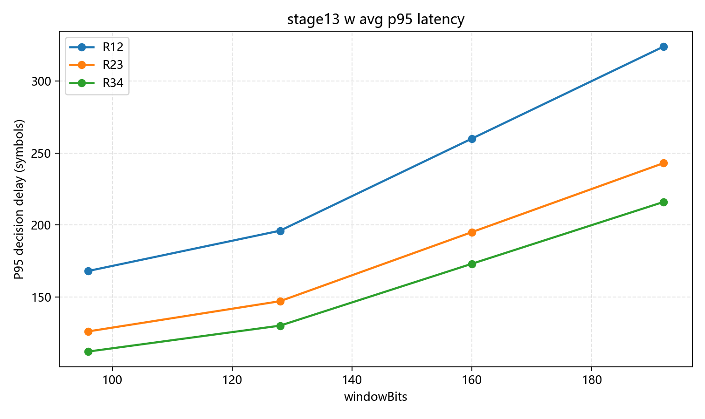

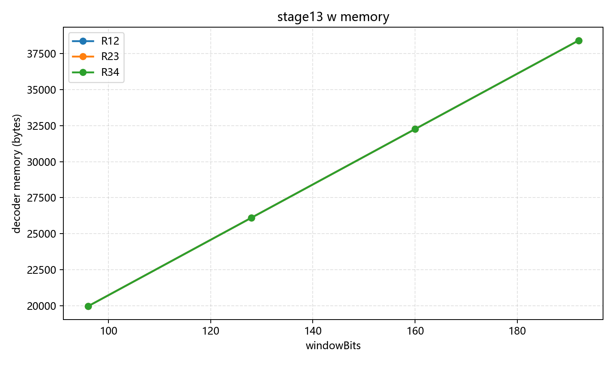

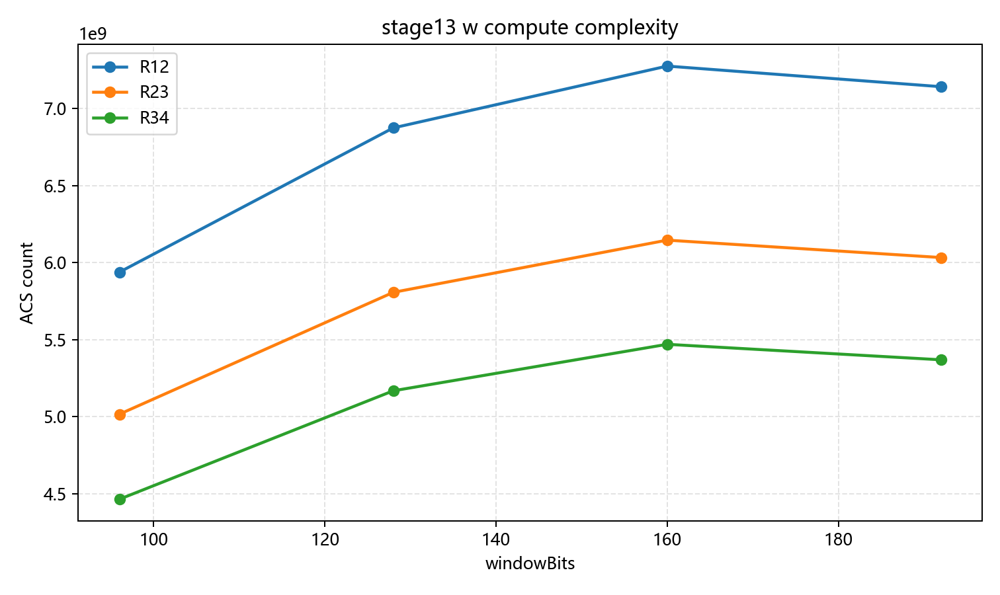

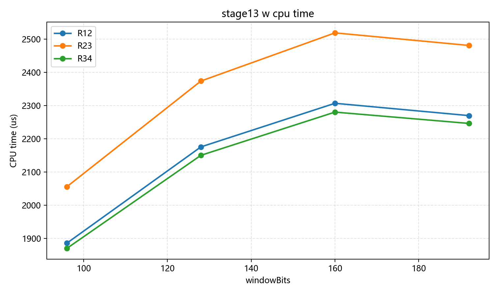

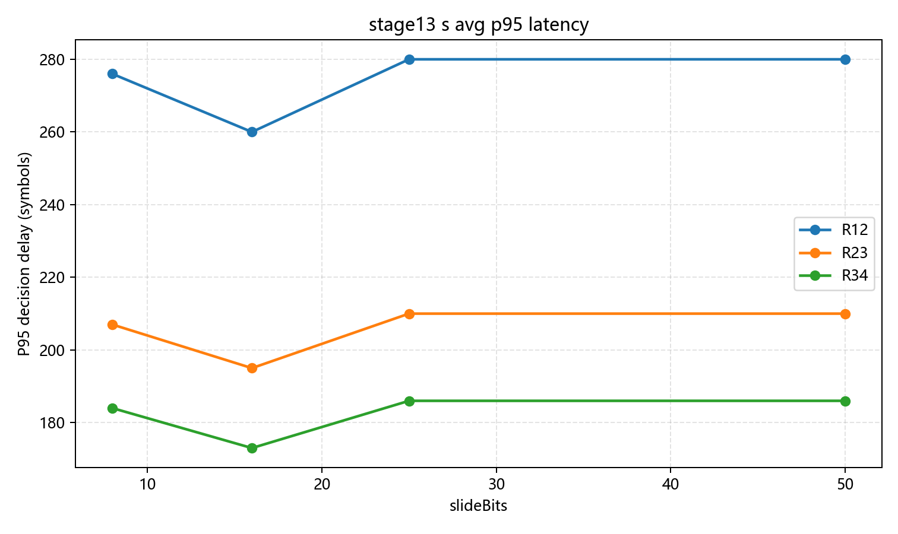

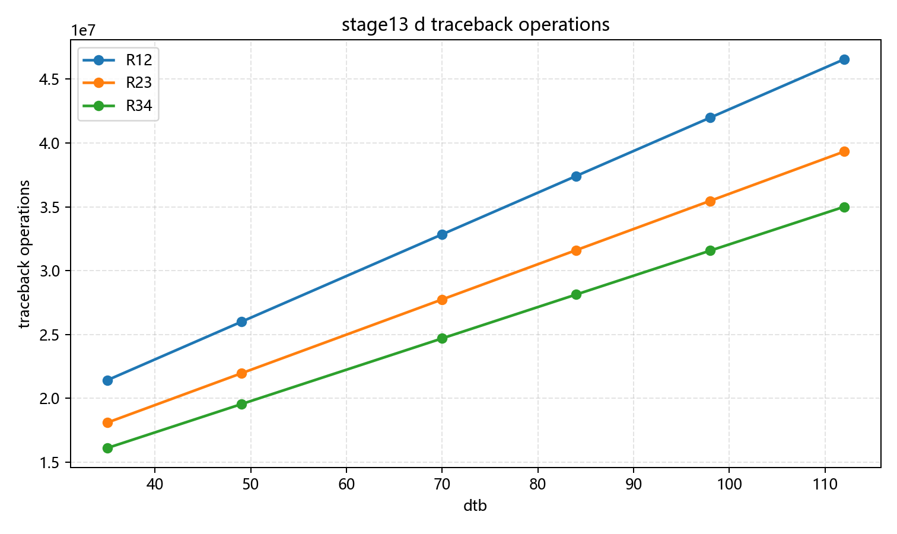
