# Stage14 正式结果分析

本轮复用 372 行 Soft Float 正式结果，仅新增 372 行 Hard 正式结果；统一表共
744 行，覆盖 2 种判决、3 种码率、4 种组织方式和每 case 31 个 Es/N0 点。

## BER、FER 与有效吞吐

- Soft: FER≈0.1 附近的 BER 范围 0.00134 到 0.00314，归一化有效吞吐范围 0.461 到 0.682。
- Hard: FER≈0.1 附近的 BER 范围 0.00168 到 0.00257，归一化有效吞吐范围 0.451 到 0.689。

对应 12 张分判决、分码率 BER/FER 图，以及
`stage14_soft_goodput_by_rate_and_organization.png` 和
`stage14_hard_goodput_by_rate_and_organization.png`。同一组织下 Soft 通常以更低
Es/N0 达到相同 FER。当前 50x6、100x3、150x2 的 BER/FER 在每个 SNR 点完全
重合，因为三者最终使用相同接收序列和滑窗边界；它们的首次输出和 P95 时延因
slot 到达时刻不同而不重合。限制：曲线只代表 -5 至 10 dB、0.5 dB 步长的离散
BPSK-AWGN 仿真；BER/FER 为零的正式点保留在 CSV，但不会在对数纵轴上以人造
下限绘制。

## 时延

Soft 的最早首次输出为 223 symbols
（R23/50x6），最晚为
610 symbols
（R12/Block300）。平均与 P95 决策时延见
`stage14_soft_avg_p95_decision_latency.png` 和
`stage14_hard_avg_p95_decision_latency.png`；每张图的源数据均在
`figure_data/`。限制：CPU 时间依赖本机 Release 构建，符号时延不依赖主机速度。

## 缓存与计算量

Soft 连续方案的峰值接收缓存范围为
272
到 562
symbols，总内存范围为
26112 到 59776
bytes。2x2 图分别展示缓存、总内存、ACS 与回溯操作，避免混用量纲。

## 连续输出与边界

三张连续输出图基于正式 CSV 持久化的首次输出、末次输出和输出批次数重建代表性
阶梯节奏；它们展示调度节奏，不是额外 Soft 正式仿真。正式连续方案共有
2325 次窗口触发记录。三张边界图按 offset 汇总
已有 Soft bitErrors/bits；Block300 明确为 `NOT_APPLICABLE`。边界统计受各 SNR
错误数量影响，应结合置信区间理解，不能把微小差异解释为确定恶化。

## 逐图数值说明

### stage14_r12_soft_ber_by_organization.png

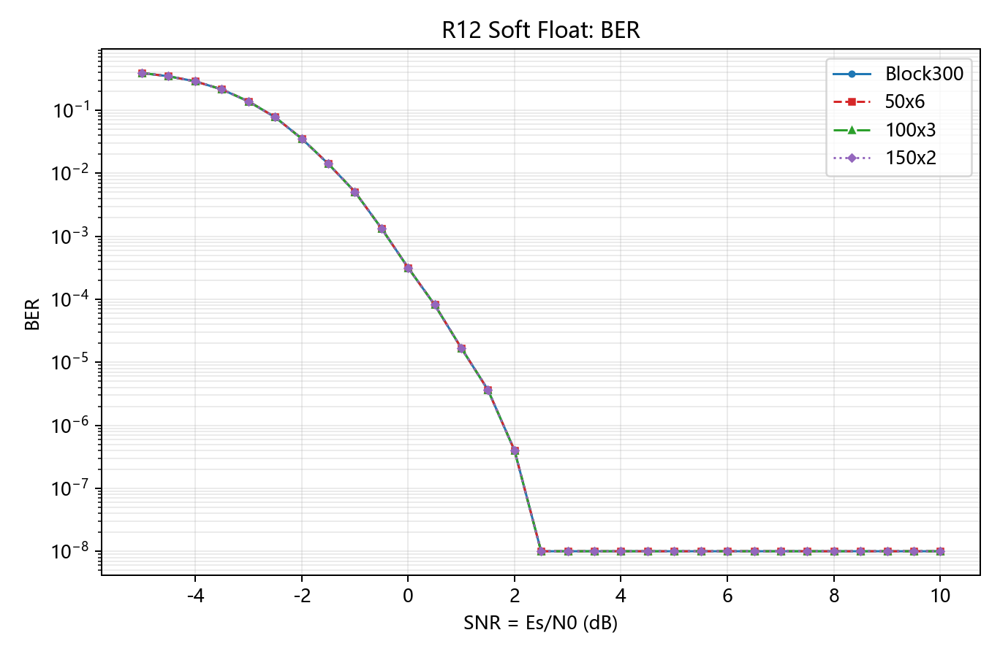

源数据 124 行；`windowBits` 范围 128 到 306，`slideBits` 范围 25 到 300。结论：该图按标题所示维度比较正式观测值，不混入其他判决或码率。限制：只在已运行 SNR 网格、组织配置和本机计时条件内解释。

### stage14_r12_soft_fer_by_organization.png

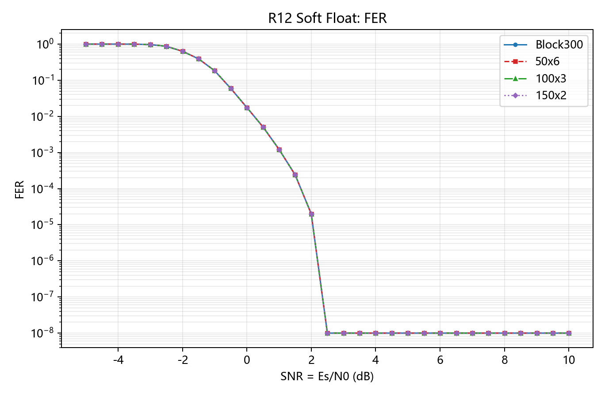

源数据 124 行；`windowBits` 范围 128 到 306，`slideBits` 范围 25 到 300。结论：该图按标题所示维度比较正式观测值，不混入其他判决或码率。限制：只在已运行 SNR 网格、组织配置和本机计时条件内解释。

### stage14_r23_soft_ber_by_organization.png

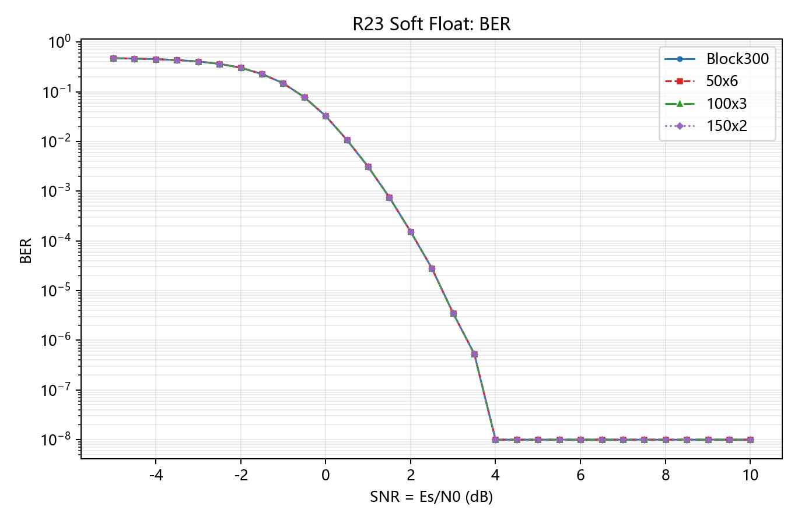

源数据 124 行；`windowBits` 范围 128 到 306，`slideBits` 范围 25 到 300。结论：该图按标题所示维度比较正式观测值，不混入其他判决或码率。限制：只在已运行 SNR 网格、组织配置和本机计时条件内解释。

### stage14_r23_soft_fer_by_organization.png

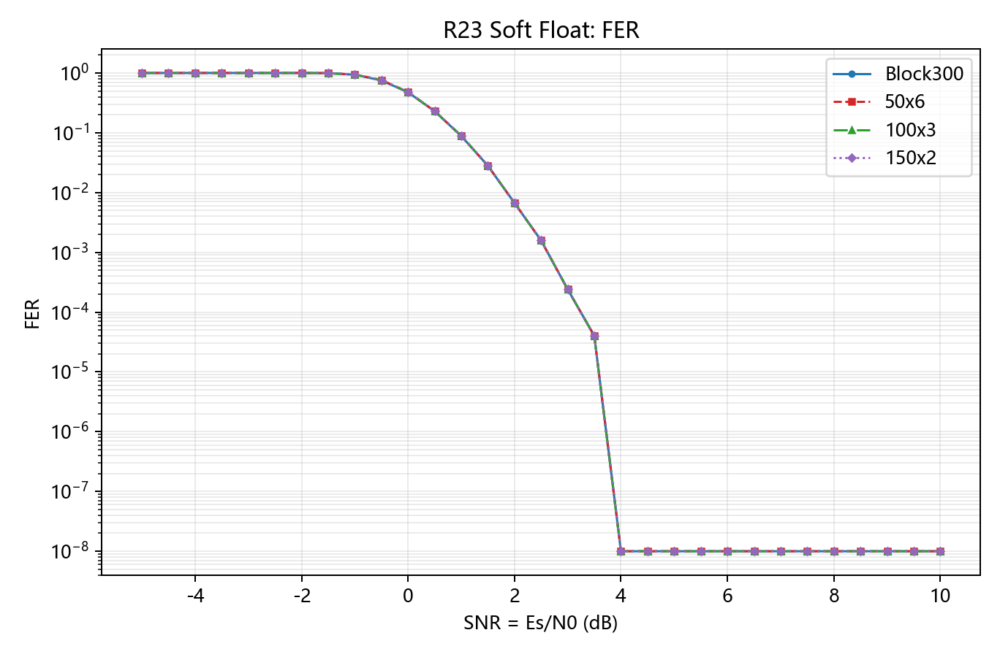

源数据 124 行；`windowBits` 范围 128 到 306，`slideBits` 范围 25 到 300。结论：该图按标题所示维度比较正式观测值，不混入其他判决或码率。限制：只在已运行 SNR 网格、组织配置和本机计时条件内解释。

### stage14_r34_soft_ber_by_organization.png

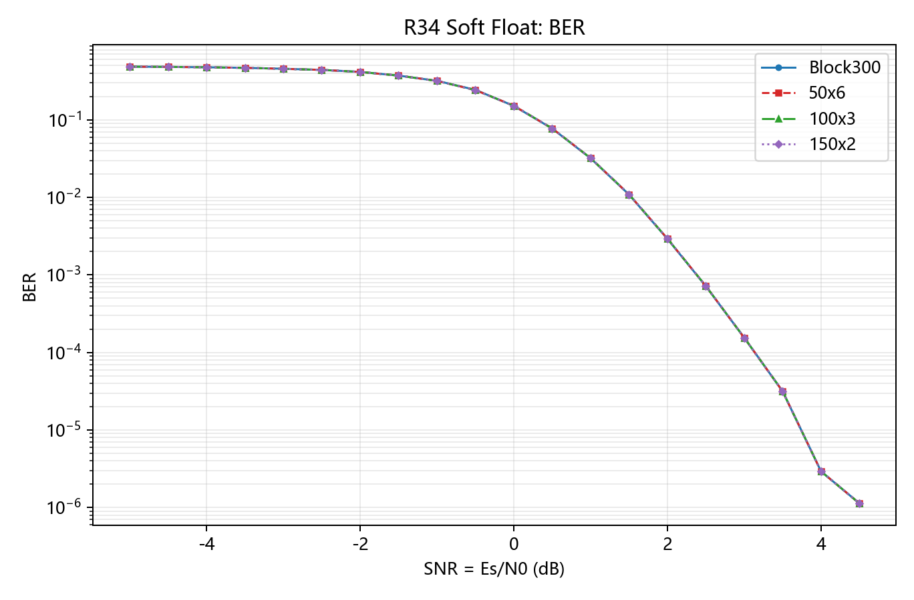

源数据 124 行；`windowBits` 范围 160 到 306，`slideBits` 范围 25 到 300。结论：该图按标题所示维度比较正式观测值，不混入其他判决或码率。限制：只在已运行 SNR 网格、组织配置和本机计时条件内解释。

### stage14_r34_soft_fer_by_organization.png

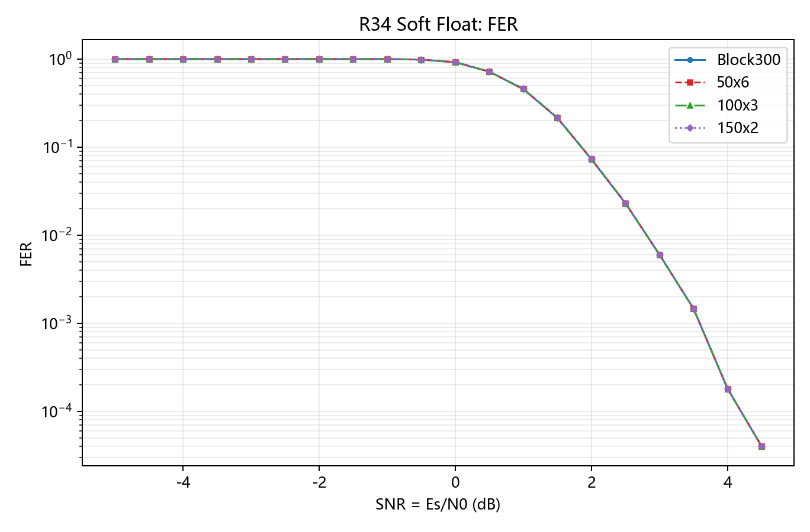

源数据 124 行；`windowBits` 范围 160 到 306，`slideBits` 范围 25 到 300。结论：该图按标题所示维度比较正式观测值，不混入其他判决或码率。限制：只在已运行 SNR 网格、组织配置和本机计时条件内解释。

### stage14_r12_hard_ber_by_organization.png

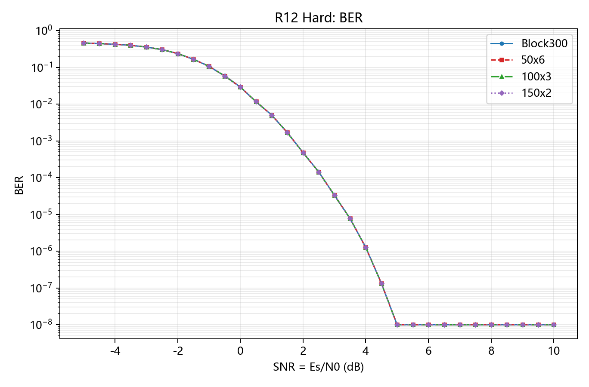

源数据 124 行；`windowBits` 范围 128 到 306，`slideBits` 范围 25 到 300。结论：该图按标题所示维度比较正式观测值，不混入其他判决或码率。限制：只在已运行 SNR 网格、组织配置和本机计时条件内解释。

### stage14_r12_hard_fer_by_organization.png

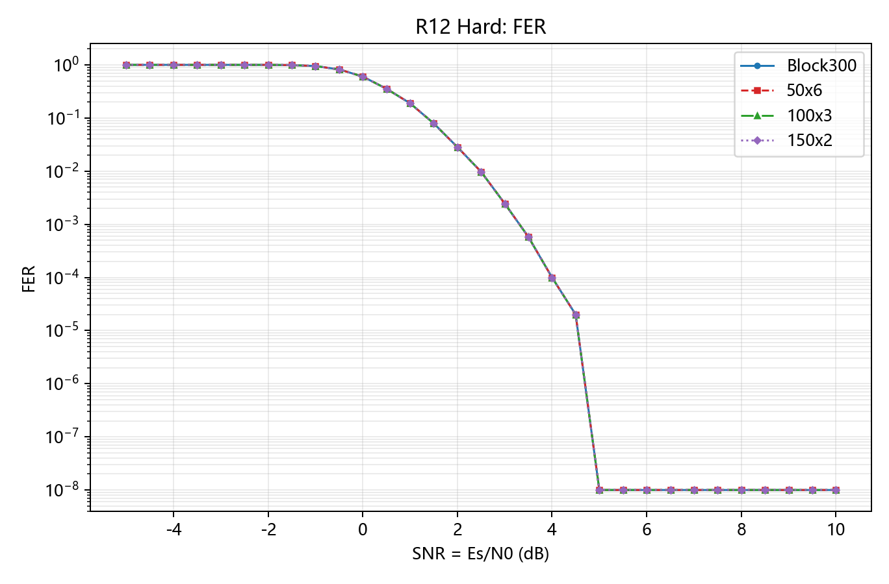

源数据 124 行；`windowBits` 范围 128 到 306，`slideBits` 范围 25 到 300。结论：该图按标题所示维度比较正式观测值，不混入其他判决或码率。限制：只在已运行 SNR 网格、组织配置和本机计时条件内解释。

### stage14_r23_hard_ber_by_organization.png

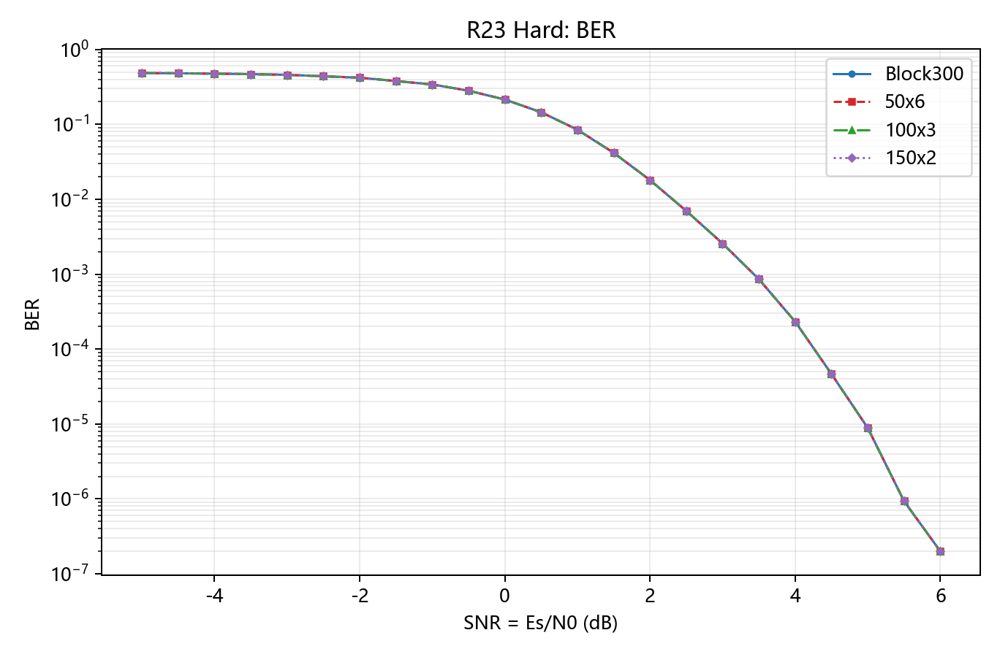

源数据 124 行；`windowBits` 范围 128 到 306，`slideBits` 范围 25 到 300。结论：该图按标题所示维度比较正式观测值，不混入其他判决或码率。限制：只在已运行 SNR 网格、组织配置和本机计时条件内解释。

### stage14_r23_hard_fer_by_organization.png

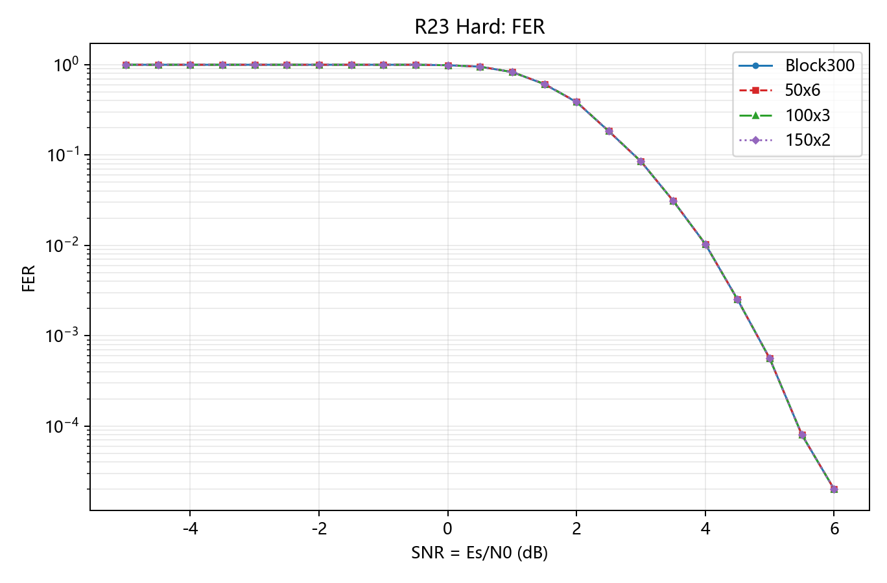

源数据 124 行；`windowBits` 范围 128 到 306，`slideBits` 范围 25 到 300。结论：该图按标题所示维度比较正式观测值，不混入其他判决或码率。限制：只在已运行 SNR 网格、组织配置和本机计时条件内解释。

### stage14_r34_hard_ber_by_organization.png

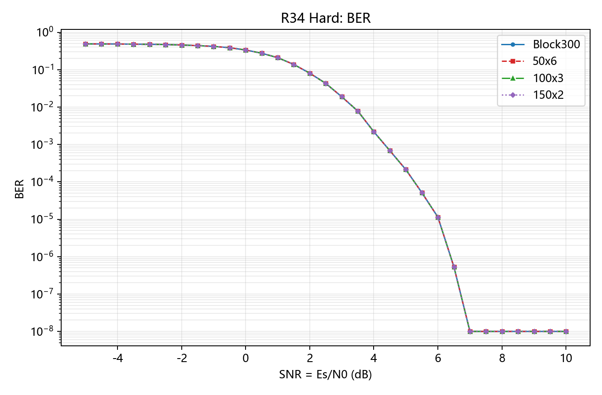

源数据 124 行；`windowBits` 范围 160 到 306，`slideBits` 范围 25 到 300。结论：该图按标题所示维度比较正式观测值，不混入其他判决或码率。限制：只在已运行 SNR 网格、组织配置和本机计时条件内解释。

### stage14_r34_hard_fer_by_organization.png

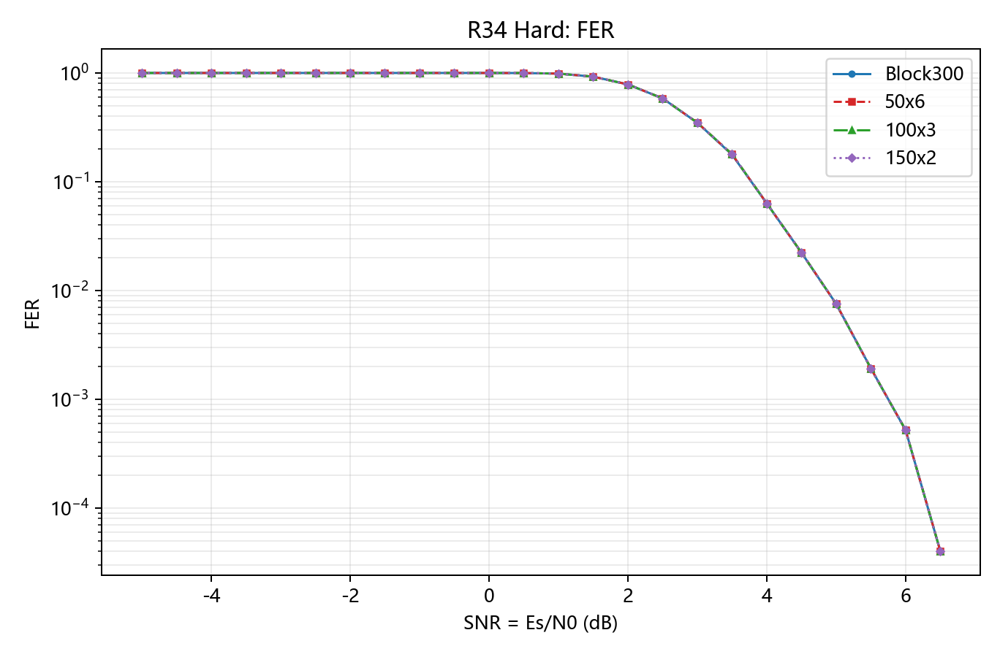

源数据 124 行；`windowBits` 范围 160 到 306，`slideBits` 范围 25 到 300。结论：该图按标题所示维度比较正式观测值，不混入其他判决或码率。限制：只在已运行 SNR 网格、组织配置和本机计时条件内解释。

### stage14_soft_goodput_by_rate_and_organization.png

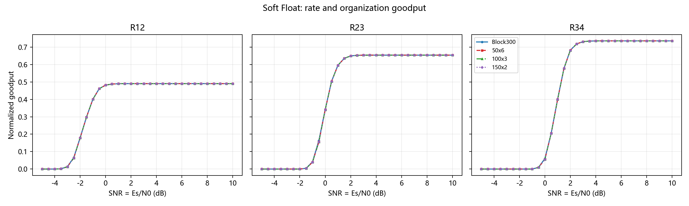

源数据 372 行；`windowBits` 范围 128 到 306，`slideBits` 范围 25 到 300。结论：该图按标题所示维度比较正式观测值，不混入其他判决或码率。限制：只在已运行 SNR 网格、组织配置和本机计时条件内解释。

### stage14_hard_goodput_by_rate_and_organization.png

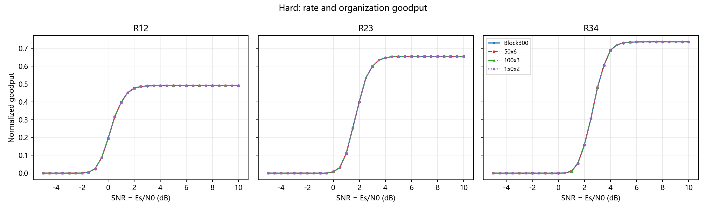

源数据 372 行；`windowBits` 范围 128 到 306，`slideBits` 范围 25 到 300。结论：该图按标题所示维度比较正式观测值，不混入其他判决或码率。限制：只在已运行 SNR 网格、组织配置和本机计时条件内解释。

### stage14_soft_first_output_latency.png

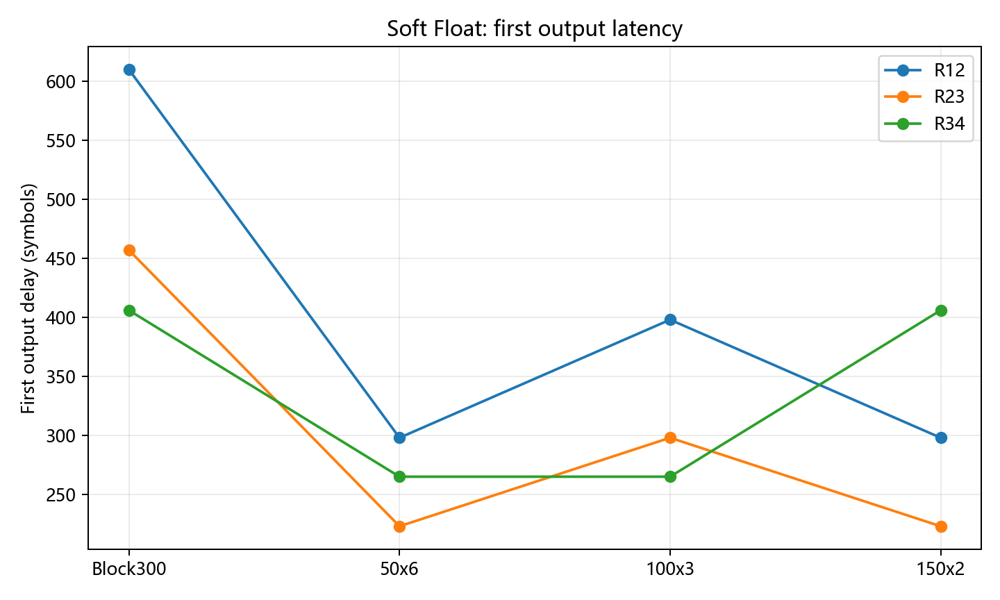

源数据 12 行；`firstOutputDelaySymbols` 范围 223 到 610，`avgDecisionDelaySymbols` 范围 171.167 到 311。结论：该图按标题所示维度比较正式观测值，不混入其他判决或码率。限制：只在已运行 SNR 网格、组织配置和本机计时条件内解释。

### stage14_soft_avg_p95_decision_latency.png

源数据 12 行；`firstOutputDelaySymbols` 范围 223 到 610，`avgDecisionDelaySymbols` 范围 171.167 到 311。结论：该图按标题所示维度比较正式观测值，不混入其他判决或码率。限制：只在已运行 SNR 网格、组织配置和本机计时条件内解释。

### stage14_soft_buffer_compute_tradeoff.png

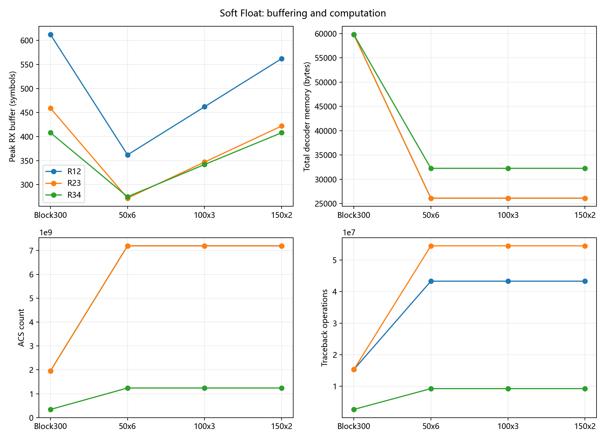

源数据 12 行；`firstOutputDelaySymbols` 范围 223 到 610，`avgDecisionDelaySymbols` 范围 171.167 到 311。结论：该图按标题所示维度比较正式观测值，不混入其他判决或码率。限制：只在已运行 SNR 网格、组织配置和本机计时条件内解释。

### stage14_hard_first_output_latency.png

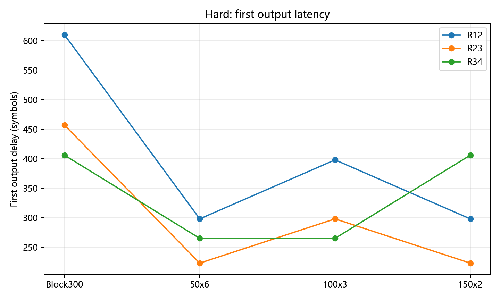

源数据 12 行；`firstOutputDelaySymbols` 范围 223 到 610，`avgDecisionDelaySymbols` 范围 171.167 到 311。结论：该图按标题所示维度比较正式观测值，不混入其他判决或码率。限制：只在已运行 SNR 网格、组织配置和本机计时条件内解释。

### stage14_hard_avg_p95_decision_latency.png

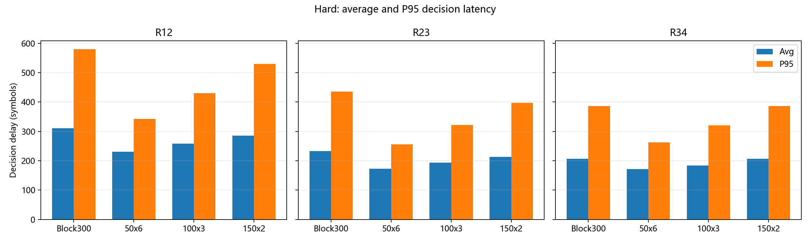

源数据 12 行；`firstOutputDelaySymbols` 范围 223 到 610，`avgDecisionDelaySymbols` 范围 171.167 到 311。结论：该图按标题所示维度比较正式观测值，不混入其他判决或码率。限制：只在已运行 SNR 网格、组织配置和本机计时条件内解释。

### stage14_hard_buffer_compute_tradeoff.png

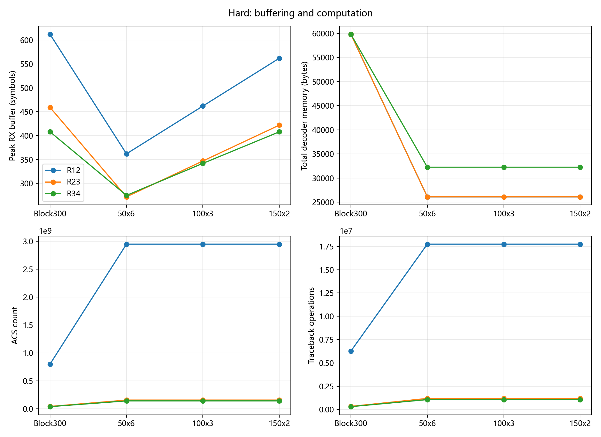

源数据 12 行；`firstOutputDelaySymbols` 范围 223 到 610，`avgDecisionDelaySymbols` 范围 171.167 到 311。结论：该图按标题所示维度比较正式观测值，不混入其他判决或码率。限制：只在已运行 SNR 网格、组织配置和本机计时条件内解释。

### stage14_r12_continuous_output_progress.png

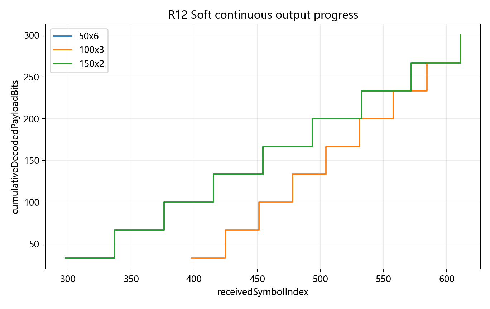

源数据 27 行；`receivedSymbolIndex` 范围 298 到 611，`cumulativeDecodedPayloadBits` 范围 33.3333 到 300。结论：该图按标题所示维度比较正式观测值，不混入其他判决或码率。限制：只在已运行 SNR 网格、组织配置和本机计时条件内解释。

### stage14_r23_continuous_output_progress.png

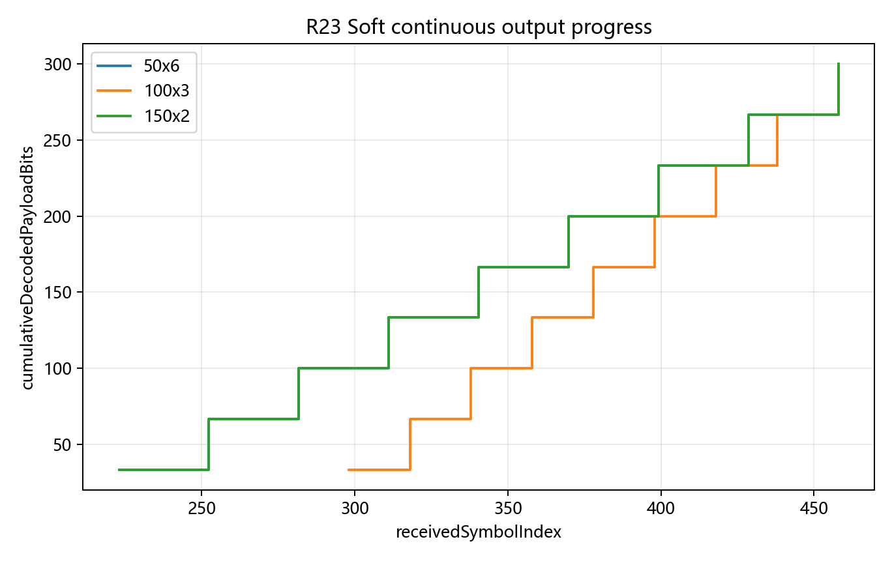

源数据 27 行；`receivedSymbolIndex` 范围 223 到 458，`cumulativeDecodedPayloadBits` 范围 33.3333 到 300。结论：该图按标题所示维度比较正式观测值，不混入其他判决或码率。限制：只在已运行 SNR 网格、组织配置和本机计时条件内解释。

### stage14_r34_continuous_output_progress.png

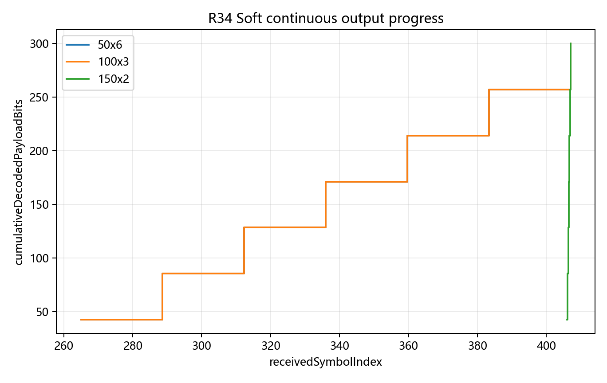

源数据 21 行；`receivedSymbolIndex` 范围 265 到 407，`cumulativeDecodedPayloadBits` 范围 42.8571 到 300。结论：该图按标题所示维度比较正式观测值，不混入其他判决或码率。限制：只在已运行 SNR 网格、组织配置和本机计时条件内解释。

### stage14_r12_boundary_relative_ber.png

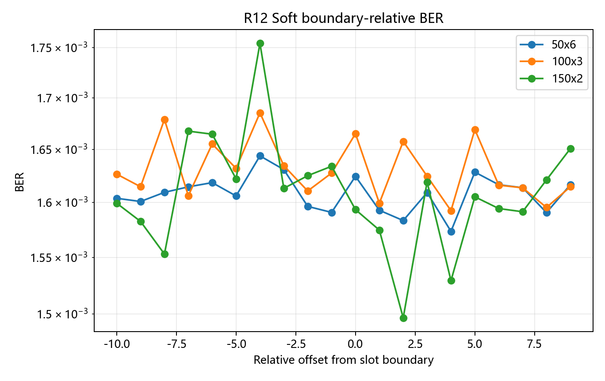

源数据 60 行；`relativeOffset` 范围 -10 到 9，`bitErrors` 范围 1516 到 8325。结论：该图按标题所示维度比较正式观测值，不混入其他判决或码率。限制：只在已运行 SNR 网格、组织配置和本机计时条件内解释。

### stage14_r23_boundary_relative_ber.png

源数据 60 行；`relativeOffset` 范围 -10 到 9，`bitErrors` 范围 3460 到 18820。结论：该图按标题所示维度比较正式观测值，不混入其他判决或码率。限制：只在已运行 SNR 网格、组织配置和本机计时条件内解释。

### stage14_r34_boundary_relative_ber.png

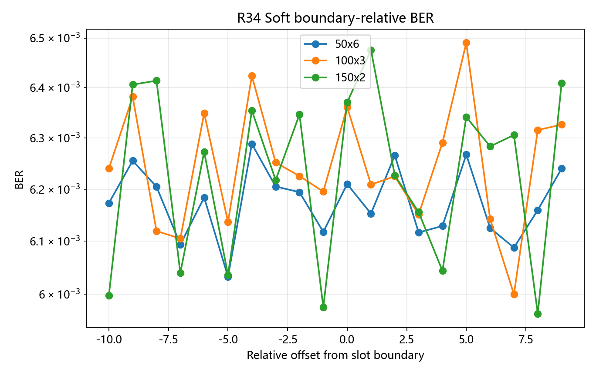

源数据 60 行；`relativeOffset` 范围 -10 到 9，`bitErrors` 范围 4525 到 23859。结论：该图按标题所示维度比较正式观测值，不混入其他判决或码率。限制：只在已运行 SNR 网格、组织配置和本机计时条件内解释。
