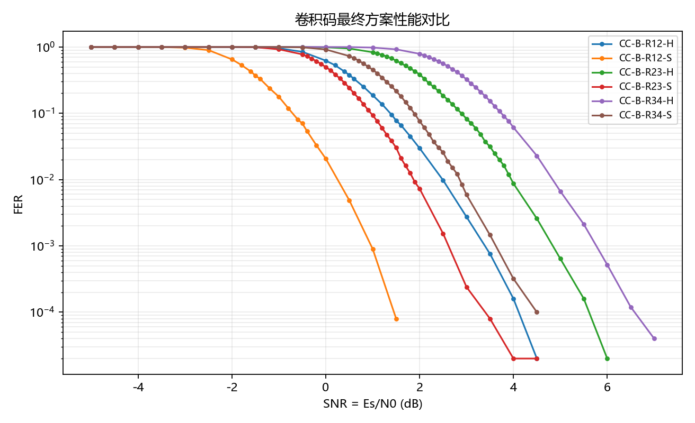
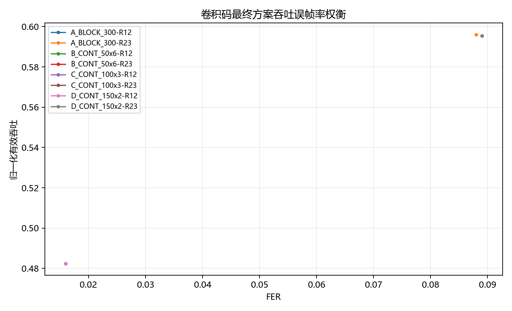
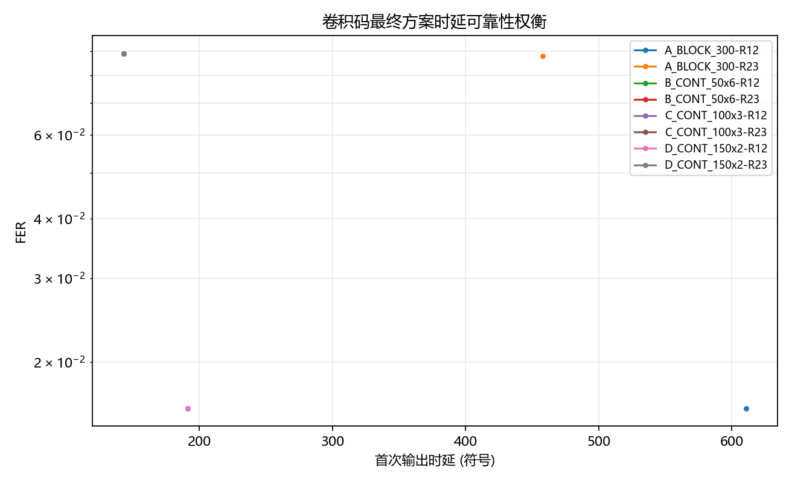

# 全部结果图介绍

## 图：stage09_awgn_formal_ber

### 图的用途
用于展示对应 Stage 的真实 CSV 结果。

### 横轴
见同名 figure-data CSV 的 xRaw/xPlot。

### 纵轴
见同名 figure-data CSV 的 yRaw/yPlot；BER/FER 图使用对数轴。

### 曲线或标记
每条曲线代表 case 或方案。

### 主要现象
以源 CSV 的具体数值为准。

### 应如何解释
用于支持参数筛选和方案权衡。

### 注意事项
SNR 定义为 Es/N0；normalizedGoodput 不是 bit/s。

## 图：stage09_awgn_formal_delay

### 图的用途
用于展示对应 Stage 的真实 CSV 结果。

### 横轴
见同名 figure-data CSV 的 xRaw/xPlot。

### 纵轴
见同名 figure-data CSV 的 yRaw/yPlot；BER/FER 图使用对数轴。

### 曲线或标记
每条曲线代表 case 或方案。

### 主要现象
以源 CSV 的具体数值为准。

### 应如何解释
用于支持参数筛选和方案权衡。

### 注意事项
SNR 定义为 Es/N0；normalizedGoodput 不是 bit/s。

## 图：stage09_awgn_formal_fer

### 图的用途
用于展示对应 Stage 的真实 CSV 结果。

### 横轴
见同名 figure-data CSV 的 xRaw/xPlot。

### 纵轴
见同名 figure-data CSV 的 yRaw/yPlot；BER/FER 图使用对数轴。

### 曲线或标记
每条曲线代表 case 或方案。

### 主要现象
以源 CSV 的具体数值为准。

### 应如何解释
用于支持参数筛选和方案权衡。

### 注意事项
SNR 定义为 Es/N0；normalizedGoodput 不是 bit/s。

## 图：stage09_awgn_formal_goodput

### 图的用途
用于展示对应 Stage 的真实 CSV 结果。

### 横轴
见同名 figure-data CSV 的 xRaw/xPlot。

### 纵轴
见同名 figure-data CSV 的 yRaw/yPlot；BER/FER 图使用对数轴。

### 曲线或标记
每条曲线代表 case 或方案。

### 主要现象
以源 CSV 的具体数值为准。

### 应如何解释
用于支持参数筛选和方案权衡。

### 注意事项
SNR 定义为 Es/N0；normalizedGoodput 不是 bit/s。

## 图：stage09_awgn_formal_hard_soft_fer

### 图的用途
用于展示对应 Stage 的真实 CSV 结果。

### 横轴
见同名 figure-data CSV 的 xRaw/xPlot。

### 纵轴
见同名 figure-data CSV 的 yRaw/yPlot；BER/FER 图使用对数轴。

### 曲线或标记
每条曲线代表 case 或方案。

### 主要现象
以源 CSV 的具体数值为准。

### 应如何解释
用于支持参数筛选和方案权衡。

### 注意事项
SNR 定义为 Es/N0；normalizedGoodput 不是 bit/s。

## 图：stage09_two_level_ber

### 图的用途
用于展示对应 Stage 的真实 CSV 结果。

### 横轴
见同名 figure-data CSV 的 xRaw/xPlot。

### 纵轴
见同名 figure-data CSV 的 yRaw/yPlot；BER/FER 图使用对数轴。

### 曲线或标记
每条曲线代表 case 或方案。

### 主要现象
以源 CSV 的具体数值为准。

### 应如何解释
用于支持参数筛选和方案权衡。

### 注意事项
SNR 定义为 Es/N0；normalizedGoodput 不是 bit/s。

## 图：stage09_two_level_delay

### 图的用途
用于展示对应 Stage 的真实 CSV 结果。

### 横轴
见同名 figure-data CSV 的 xRaw/xPlot。

### 纵轴
见同名 figure-data CSV 的 yRaw/yPlot；BER/FER 图使用对数轴。

### 曲线或标记
每条曲线代表 case 或方案。

### 主要现象
以源 CSV 的具体数值为准。

### 应如何解释
用于支持参数筛选和方案权衡。

### 注意事项
SNR 定义为 Es/N0；normalizedGoodput 不是 bit/s。

## 图：stage09_two_level_fer

### 图的用途
用于展示对应 Stage 的真实 CSV 结果。

### 横轴
见同名 figure-data CSV 的 xRaw/xPlot。

### 纵轴
见同名 figure-data CSV 的 yRaw/yPlot；BER/FER 图使用对数轴。

### 曲线或标记
每条曲线代表 case 或方案。

### 主要现象
以源 CSV 的具体数值为准。

### 应如何解释
用于支持参数筛选和方案权衡。

### 注意事项
SNR 定义为 Es/N0；normalizedGoodput 不是 bit/s。

## 图：stage09_two_level_goodput

### 图的用途
用于展示对应 Stage 的真实 CSV 结果。

### 横轴
见同名 figure-data CSV 的 xRaw/xPlot。

### 纵轴
见同名 figure-data CSV 的 yRaw/yPlot；BER/FER 图使用对数轴。

### 曲线或标记
每条曲线代表 case 或方案。

### 主要现象
以源 CSV 的具体数值为准。

### 应如何解释
用于支持参数筛选和方案权衡。

### 注意事项
SNR 定义为 Es/N0；normalizedGoodput 不是 bit/s。

## 图：stage09_two_level_hard_soft_fer

### 图的用途
用于展示对应 Stage 的真实 CSV 结果。

### 横轴
见同名 figure-data CSV 的 xRaw/xPlot。

### 纵轴
见同名 figure-data CSV 的 yRaw/yPlot；BER/FER 图使用对数轴。

### 曲线或标记
每条曲线代表 case 或方案。

### 主要现象
以源 CSV 的具体数值为准。

### 应如何解释
用于支持参数筛选和方案权衡。

### 注意事项
SNR 定义为 Es/N0；normalizedGoodput 不是 bit/s。

## 图：stage10_traceback_ber

### 图的用途
用于展示对应 Stage 的真实 CSV 结果。

### 横轴
见同名 figure-data CSV 的 xRaw/xPlot。

### 纵轴
见同名 figure-data CSV 的 yRaw/yPlot；BER/FER 图使用对数轴。

### 曲线或标记
每条曲线代表 case 或方案。

### 主要现象
以源 CSV 的具体数值为准。

### 应如何解释
用于支持参数筛选和方案权衡。

### 注意事项
SNR 定义为 Es/N0；normalizedGoodput 不是 bit/s。

## 图：stage10_traceback_fer

### 图的用途
用于展示对应 Stage 的真实 CSV 结果。

### 横轴
见同名 figure-data CSV 的 xRaw/xPlot。

### 纵轴
见同名 figure-data CSV 的 yRaw/yPlot；BER/FER 图使用对数轴。

### 曲线或标记
每条曲线代表 case 或方案。

### 主要现象
以源 CSV 的具体数值为准。

### 应如何解释
用于支持参数筛选和方案权衡。

### 注意事项
SNR 定义为 Es/N0；normalizedGoodput 不是 bit/s。

## 图：stage10_traceback_latency

### 图的用途
用于展示对应 Stage 的真实 CSV 结果。

### 横轴
见同名 figure-data CSV 的 xRaw/xPlot。

### 纵轴
见同名 figure-data CSV 的 yRaw/yPlot；BER/FER 图使用对数轴。

### 曲线或标记
每条曲线代表 case 或方案。

### 主要现象
以源 CSV 的具体数值为准。

### 应如何解释
用于支持参数筛选和方案权衡。

### 注意事项
SNR 定义为 Es/N0；normalizedGoodput 不是 bit/s。

## 图：stage10_traceback_memory

### 图的用途
用于展示对应 Stage 的真实 CSV 结果。

### 横轴
见同名 figure-data CSV 的 xRaw/xPlot。

### 纵轴
见同名 figure-data CSV 的 yRaw/yPlot；BER/FER 图使用对数轴。

### 曲线或标记
每条曲线代表 case 或方案。

### 主要现象
以源 CSV 的具体数值为准。

### 应如何解释
用于支持参数筛选和方案权衡。

### 注意事项
SNR 定义为 Es/N0；normalizedGoodput 不是 bit/s。

## 图：stage11_quantization_ber

### 图的用途
用于展示对应 Stage 的真实 CSV 结果。

### 横轴
见同名 figure-data CSV 的 xRaw/xPlot。

### 纵轴
见同名 figure-data CSV 的 yRaw/yPlot；BER/FER 图使用对数轴。

### 曲线或标记
每条曲线代表 case 或方案。

### 主要现象
以源 CSV 的具体数值为准。

### 应如何解释
用于支持参数筛选和方案权衡。

### 注意事项
SNR 定义为 Es/N0；normalizedGoodput 不是 bit/s。

## 图：stage11_quantization_fer

### 图的用途
用于展示对应 Stage 的真实 CSV 结果。

### 横轴
见同名 figure-data CSV 的 xRaw/xPlot。

### 纵轴
见同名 figure-data CSV 的 yRaw/yPlot；BER/FER 图使用对数轴。

### 曲线或标记
每条曲线代表 case 或方案。

### 主要现象
以源 CSV 的具体数值为准。

### 应如何解释
用于支持参数筛选和方案权衡。

### 注意事项
SNR 定义为 Es/N0；normalizedGoodput 不是 bit/s。

## 图：stage11_quantization_latency

### 图的用途
用于展示对应 Stage 的真实 CSV 结果。

### 横轴
见同名 figure-data CSV 的 xRaw/xPlot。

### 纵轴
见同名 figure-data CSV 的 yRaw/yPlot；BER/FER 图使用对数轴。

### 曲线或标记
每条曲线代表 case 或方案。

### 主要现象
以源 CSV 的具体数值为准。

### 应如何解释
用于支持参数筛选和方案权衡。

### 注意事项
SNR 定义为 Es/N0；normalizedGoodput 不是 bit/s。

## 图：stage11_quantization_memory

### 图的用途
用于展示对应 Stage 的真实 CSV 结果。

### 横轴
见同名 figure-data CSV 的 xRaw/xPlot。

### 纵轴
见同名 figure-data CSV 的 yRaw/yPlot；BER/FER 图使用对数轴。

### 曲线或标记
每条曲线代表 case 或方案。

### 主要现象
以源 CSV 的具体数值为准。

### 应如何解释
用于支持参数筛选和方案权衡。

### 注意事项
SNR 定义为 Es/N0；normalizedGoodput 不是 bit/s。

## 图：stage11_quantization_saturation

### 图的用途
用于展示对应 Stage 的真实 CSV 结果。

### 横轴
见同名 figure-data CSV 的 xRaw/xPlot。

### 纵轴
见同名 figure-data CSV 的 yRaw/yPlot；BER/FER 图使用对数轴。

### 曲线或标记
每条曲线代表 case 或方案。

### 主要现象
以源 CSV 的具体数值为准。

### 应如何解释
用于支持参数筛选和方案权衡。

### 注意事项
SNR 定义为 Es/N0；normalizedGoodput 不是 bit/s。

## 图：stage13_latency_reliability_tradeoff

### 图的用途
用于展示对应 Stage 的真实 CSV 结果。

### 横轴
见同名 figure-data CSV 的 xRaw/xPlot。

### 纵轴
见同名 figure-data CSV 的 yRaw/yPlot；BER/FER 图使用对数轴。

### 曲线或标记
每条曲线代表 case 或方案。

### 主要现象
以源 CSV 的具体数值为准。

### 应如何解释
用于支持参数筛选和方案权衡。

### 注意事项
SNR 定义为 Es/N0；normalizedGoodput 不是 bit/s。

## 图：stage13_window_ber

### 图的用途
用于展示对应 Stage 的真实 CSV 结果。

### 横轴
见同名 figure-data CSV 的 xRaw/xPlot。

### 纵轴
见同名 figure-data CSV 的 yRaw/yPlot；BER/FER 图使用对数轴。

### 曲线或标记
每条曲线代表 case 或方案。

### 主要现象
以源 CSV 的具体数值为准。

### 应如何解释
用于支持参数筛选和方案权衡。

### 注意事项
SNR 定义为 Es/N0；normalizedGoodput 不是 bit/s。

## 图：stage13_window_fer

### 图的用途
用于展示对应 Stage 的真实 CSV 结果。

### 横轴
见同名 figure-data CSV 的 xRaw/xPlot。

### 纵轴
见同名 figure-data CSV 的 yRaw/yPlot；BER/FER 图使用对数轴。

### 曲线或标记
每条曲线代表 case 或方案。

### 主要现象
以源 CSV 的具体数值为准。

### 应如何解释
用于支持参数筛选和方案权衡。

### 注意事项
SNR 定义为 Es/N0；normalizedGoodput 不是 bit/s。

## 图：stage13_window_latency

### 图的用途
用于展示对应 Stage 的真实 CSV 结果。

### 横轴
见同名 figure-data CSV 的 xRaw/xPlot。

### 纵轴
见同名 figure-data CSV 的 yRaw/yPlot；BER/FER 图使用对数轴。

### 曲线或标记
每条曲线代表 case 或方案。

### 主要现象
以源 CSV 的具体数值为准。

### 应如何解释
用于支持参数筛选和方案权衡。

### 注意事项
SNR 定义为 Es/N0；normalizedGoodput 不是 bit/s。

## 图：stage13_window_memory

### 图的用途
用于展示对应 Stage 的真实 CSV 结果。

### 横轴
见同名 figure-data CSV 的 xRaw/xPlot。

### 纵轴
见同名 figure-data CSV 的 yRaw/yPlot；BER/FER 图使用对数轴。

### 曲线或标记
每条曲线代表 case 或方案。

### 主要现象
以源 CSV 的具体数值为准。

### 应如何解释
用于支持参数筛选和方案权衡。

### 注意事项
SNR 定义为 Es/N0；normalizedGoodput 不是 bit/s。

## 图：stage13_window_mismatch

### 图的用途
用于展示对应 Stage 的真实 CSV 结果。

### 横轴
见同名 figure-data CSV 的 xRaw/xPlot。

### 纵轴
见同名 figure-data CSV 的 yRaw/yPlot；BER/FER 图使用对数轴。

### 曲线或标记
每条曲线代表 case 或方案。

### 主要现象
以源 CSV 的具体数值为准。

### 应如何解释
用于支持参数筛选和方案权衡。

### 注意事项
SNR 定义为 Es/N0；normalizedGoodput 不是 bit/s。

## 图：stage14_boundary_ber

### 图的用途
用于展示对应 Stage 的真实 CSV 结果。

### 横轴
见同名 figure-data CSV 的 xRaw/xPlot。

### 纵轴
见同名 figure-data CSV 的 yRaw/yPlot；BER/FER 图使用对数轴。

### 曲线或标记
每条曲线代表 case 或方案。

### 主要现象
以源 CSV 的具体数值为准。

### 应如何解释
用于支持参数筛选和方案权衡。

### 注意事项
SNR 定义为 Es/N0；normalizedGoodput 不是 bit/s。

## 图：stage14_first_output_latency

### 图的用途
用于展示对应 Stage 的真实 CSV 结果。

### 横轴
见同名 figure-data CSV 的 xRaw/xPlot。

### 纵轴
见同名 figure-data CSV 的 yRaw/yPlot；BER/FER 图使用对数轴。

### 曲线或标记
每条曲线代表 case 或方案。

### 主要现象
以源 CSV 的具体数值为准。

### 应如何解释
用于支持参数筛选和方案权衡。

### 注意事项
SNR 定义为 Es/N0；normalizedGoodput 不是 bit/s。

## 图：stage14_full_frame_latency

### 图的用途
用于展示对应 Stage 的真实 CSV 结果。

### 横轴
见同名 figure-data CSV 的 xRaw/xPlot。

### 纵轴
见同名 figure-data CSV 的 yRaw/yPlot；BER/FER 图使用对数轴。

### 曲线或标记
每条曲线代表 case 或方案。

### 主要现象
以源 CSV 的具体数值为准。

### 应如何解释
用于支持参数筛选和方案权衡。

### 注意事项
SNR 定义为 Es/N0；normalizedGoodput 不是 bit/s。

## 图：stage14_goodput

### 图的用途
用于展示对应 Stage 的真实 CSV 结果。

### 横轴
见同名 figure-data CSV 的 xRaw/xPlot。

### 纵轴
见同名 figure-data CSV 的 yRaw/yPlot；BER/FER 图使用对数轴。

### 曲线或标记
每条曲线代表 case 或方案。

### 主要现象
以源 CSV 的具体数值为准。

### 应如何解释
用于支持参数筛选和方案权衡。

### 注意事项
SNR 定义为 Es/N0；normalizedGoodput 不是 bit/s。

## 图：stage14_organization_ber

### 图的用途
用于展示对应 Stage 的真实 CSV 结果。

### 横轴
见同名 figure-data CSV 的 xRaw/xPlot。

### 纵轴
见同名 figure-data CSV 的 yRaw/yPlot；BER/FER 图使用对数轴。

### 曲线或标记
每条曲线代表 case 或方案。

### 主要现象
以源 CSV 的具体数值为准。

### 应如何解释
用于支持参数筛选和方案权衡。

### 注意事项
SNR 定义为 Es/N0；normalizedGoodput 不是 bit/s。

## 图：stage14_organization_fer

### 图的用途
用于展示对应 Stage 的真实 CSV 结果。

### 横轴
见同名 figure-data CSV 的 xRaw/xPlot。

### 纵轴
见同名 figure-data CSV 的 yRaw/yPlot；BER/FER 图使用对数轴。

### 曲线或标记
每条曲线代表 case 或方案。

### 主要现象
以源 CSV 的具体数值为准。

### 应如何解释
用于支持参数筛选和方案权衡。

### 注意事项
SNR 定义为 Es/N0；normalizedGoodput 不是 bit/s。

## 图：stage15_final_scheme_performance

### 图的用途
用于展示对应 Stage 的真实 CSV 结果。

### 横轴
见同名 figure-data CSV 的 xRaw/xPlot。

### 纵轴
见同名 figure-data CSV 的 yRaw/yPlot；BER/FER 图使用对数轴。

### 曲线或标记
每条曲线代表 case 或方案。

### 主要现象
以源 CSV 的具体数值为准。

### 应如何解释
用于支持参数筛选和方案权衡。

### 注意事项
SNR 定义为 Es/N0；normalizedGoodput 不是 bit/s。

## 图：stage15_goodput_fer_tradeoff

### 图的用途
用于展示对应 Stage 的真实 CSV 结果。

### 横轴
见同名 figure-data CSV 的 xRaw/xPlot。

### 纵轴
见同名 figure-data CSV 的 yRaw/yPlot；BER/FER 图使用对数轴。

### 曲线或标记
每条曲线代表 case 或方案。

### 主要现象
以源 CSV 的具体数值为准。

### 应如何解释
用于支持参数筛选和方案权衡。

### 注意事项
SNR 定义为 Es/N0；normalizedGoodput 不是 bit/s。

## 图：stage15_latency_reliability_tradeoff

### 图的用途
用于展示对应 Stage 的真实 CSV 结果。

### 横轴
见同名 figure-data CSV 的 xRaw/xPlot。

### 纵轴
见同名 figure-data CSV 的 yRaw/yPlot；BER/FER 图使用对数轴。

### 曲线或标记
每条曲线代表 case 或方案。

### 主要现象
以源 CSV 的具体数值为准。

### 应如何解释
用于支持参数筛选和方案权衡。

### 注意事项
SNR 定义为 Es/N0；normalizedGoodput 不是 bit/s。
