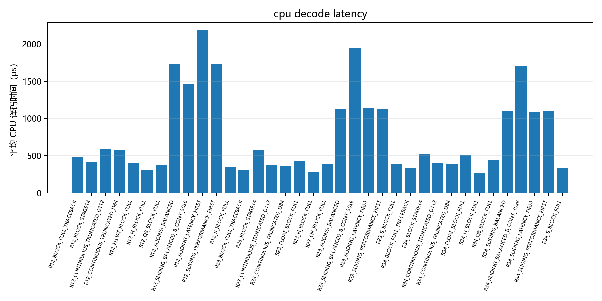
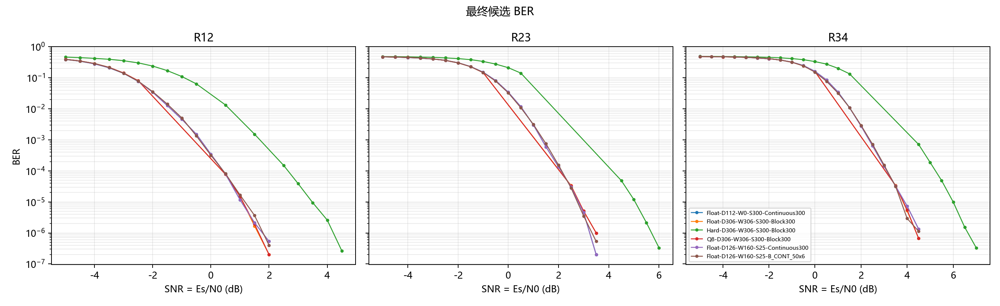
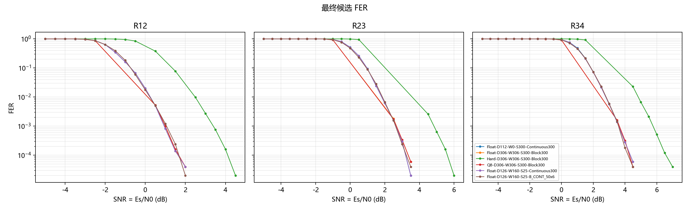
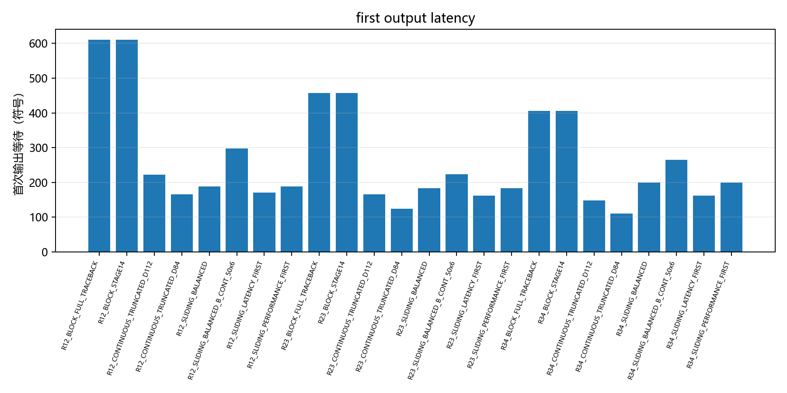
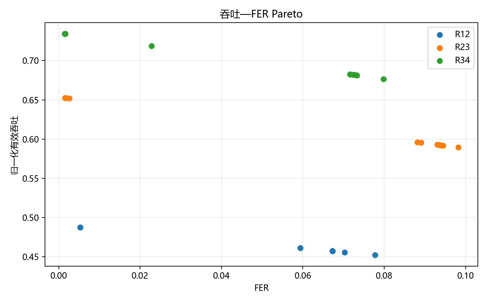
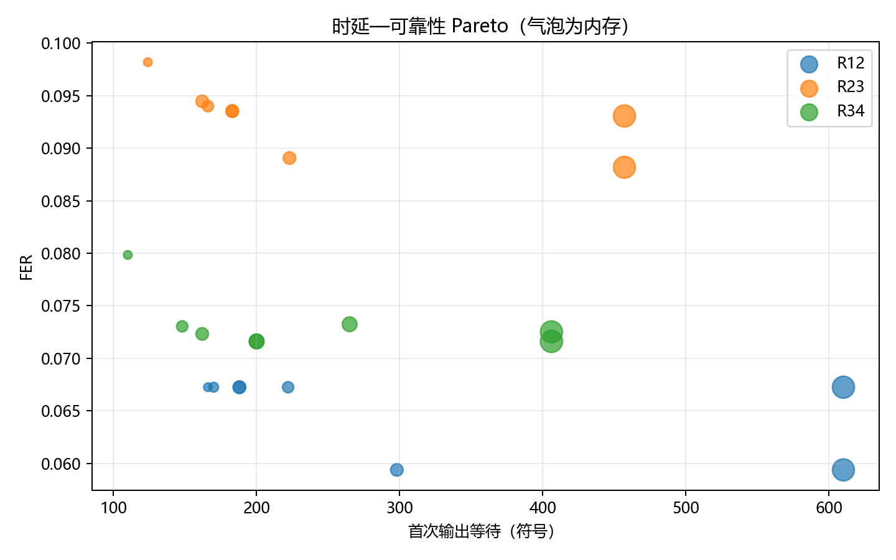
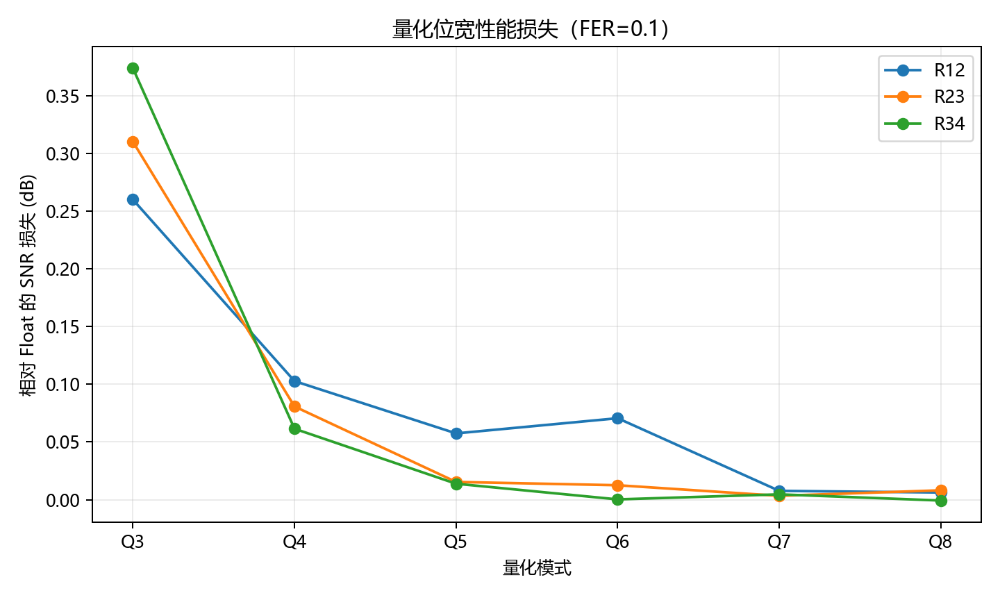

# CC S3 all figures guide

All BER/FER figures use SNR = Es/N0 (dB). Zero observations remain unchanged in the formal CSV but are omitted from log-scale figures. Curves are pointwise and unsmoothed.

## stage08_awgn_prescan_ber.png

Purpose and axes follow the filename and its adjacent figure-data CSV/plot manifest. Interpret only within the measured SNR grid and confidence intervals.

## stage08_awgn_prescan_fer.png

Purpose and axes follow the filename and its adjacent figure-data CSV/plot manifest. Interpret only within the measured SNR grid and confidence intervals.

## stage09_two_level_ber.png

Purpose and axes follow the filename and its adjacent figure-data CSV/plot manifest. Interpret only within the measured SNR grid and confidence intervals.

## stage09_two_level_delay.png

Purpose and axes follow the filename and its adjacent figure-data CSV/plot manifest. Interpret only within the measured SNR grid and confidence intervals.

## stage09_two_level_fer.png

Purpose and axes follow the filename and its adjacent figure-data CSV/plot manifest. Interpret only within the measured SNR grid and confidence intervals.

## stage09_two_level_goodput.png

Purpose and axes follow the filename and its adjacent figure-data CSV/plot manifest. Interpret only within the measured SNR grid and confidence intervals.

## stage09_two_level_hard_soft_fer.png

Purpose and axes follow the filename and its adjacent figure-data CSV/plot manifest. Interpret only within the measured SNR grid and confidence intervals.

## stage10_memory_reliability_tradeoff.png

Purpose and axes follow the filename and its adjacent figure-data CSV/plot manifest. Interpret only within the measured SNR grid and confidence intervals.

## stage10_traceback_ber.png

Purpose and axes follow the filename and its adjacent figure-data CSV/plot manifest. Interpret only within the measured SNR grid and confidence intervals.

## stage10_traceback_cpu_latency.png

Purpose and axes follow the filename and its adjacent figure-data CSV/plot manifest. Interpret only within the measured SNR grid and confidence intervals.

## stage10_traceback_fer.png

Purpose and axes follow the filename and its adjacent figure-data CSV/plot manifest. Interpret only within the measured SNR grid and confidence intervals.

## stage10_traceback_memory.png

Purpose and axes follow the filename and its adjacent figure-data CSV/plot manifest. Interpret only within the measured SNR grid and confidence intervals.

## stage10_traceback_relative_fer_loss.png

Purpose and axes follow the filename and its adjacent figure-data CSV/plot manifest. Interpret only within the measured SNR grid and confidence intervals.

## stage11_quantization_latency.png

Purpose and axes follow the filename and its adjacent figure-data CSV/plot manifest. Interpret only within the measured SNR grid and confidence intervals.

## stage11_quantization_memory.png

Purpose and axes follow the filename and its adjacent figure-data CSV/plot manifest. Interpret only within the measured SNR grid and confidence intervals.

## stage11_quantization_snr_loss.png

Purpose and axes follow the filename and its adjacent figure-data CSV/plot manifest. Interpret only within the measured SNR grid and confidence intervals.

## stage11_quantization_true_clip.png

Purpose and axes follow the filename and its adjacent figure-data CSV/plot manifest. Interpret only within the measured SNR grid and confidence intervals.

## stage11_r12_quantization_ber.png

Purpose and axes follow the filename and its adjacent figure-data CSV/plot manifest. Interpret only within the measured SNR grid and confidence intervals.

## stage11_r12_quantization_fer.png

Purpose and axes follow the filename and its adjacent figure-data CSV/plot manifest. Interpret only within the measured SNR grid and confidence intervals.

## stage11_r12_representative_fer.png

Purpose and axes follow the filename and its adjacent figure-data CSV/plot manifest. Interpret only within the measured SNR grid and confidence intervals.

## stage11_r23_quantization_ber.png

Purpose and axes follow the filename and its adjacent figure-data CSV/plot manifest. Interpret only within the measured SNR grid and confidence intervals.

## stage11_r23_quantization_fer.png

Purpose and axes follow the filename and its adjacent figure-data CSV/plot manifest. Interpret only within the measured SNR grid and confidence intervals.

## stage11_r23_representative_fer.png

Purpose and axes follow the filename and its adjacent figure-data CSV/plot manifest. Interpret only within the measured SNR grid and confidence intervals.

## stage11_r34_quantization_ber.png

Purpose and axes follow the filename and its adjacent figure-data CSV/plot manifest. Interpret only within the measured SNR grid and confidence intervals.

## stage11_r34_quantization_fer.png

Purpose and axes follow the filename and its adjacent figure-data CSV/plot manifest. Interpret only within the measured SNR grid and confidence intervals.

## stage11_r34_representative_fer.png

Purpose and axes follow the filename and its adjacent figure-data CSV/plot manifest. Interpret only within the measured SNR grid and confidence intervals.

## stage13_control_d_ber_fer.png

Purpose and axes follow the filename and its adjacent figure-data CSV/plot manifest. Interpret only within the measured SNR grid and confidence intervals.

## stage13_control_s_ber_fer.png

Purpose and axes follow the filename and its adjacent figure-data CSV/plot manifest. Interpret only within the measured SNR grid and confidence intervals.

## stage13_control_w_ber_fer.png

Purpose and axes follow the filename and its adjacent figure-data CSV/plot manifest. Interpret only within the measured SNR grid and confidence intervals.

## stage13_d_traceback_operations.png

Purpose and axes follow the filename and its adjacent figure-data CSV/plot manifest. Interpret only within the measured SNR grid and confidence intervals.

## stage13_delay_reliability_pareto.png

Purpose and axes follow the filename and its adjacent figure-data CSV/plot manifest. Interpret only within the measured SNR grid and confidence intervals.

## stage13_final_ber_comparison.png

Purpose and axes follow the filename and its adjacent figure-data CSV/plot manifest. Interpret only within the measured SNR grid and confidence intervals.

## stage13_final_complexity_comparison.png

Purpose and axes follow the filename and its adjacent figure-data CSV/plot manifest. Interpret only within the measured SNR grid and confidence intervals.

## stage13_final_fer_comparison.png

Purpose and axes follow the filename and its adjacent figure-data CSV/plot manifest. Interpret only within the measured SNR grid and confidence intervals.

## stage13_final_latency_comparison.png

Purpose and axes follow the filename and its adjacent figure-data CSV/plot manifest. Interpret only within the measured SNR grid and confidence intervals.

## stage13_final_memory_comparison.png

Purpose and axes follow the filename and its adjacent figure-data CSV/plot manifest. Interpret only within the measured SNR grid and confidence intervals.

## stage13_memory_reliability_pareto.png

Purpose and axes follow the filename and its adjacent figure-data CSV/plot manifest. Interpret only within the measured SNR grid and confidence intervals.

## stage13_mismatch_heatmap.png

Purpose and axes follow the filename and its adjacent figure-data CSV/plot manifest. Interpret only within the measured SNR grid and confidence intervals.

## stage13_s_steady_output_interval.png

Purpose and axes follow the filename and its adjacent figure-data CSV/plot manifest. Interpret only within the measured SNR grid and confidence intervals.

## stage13_w_actual_memory.png

Purpose and axes follow the filename and its adjacent figure-data CSV/plot manifest. Interpret only within the measured SNR grid and confidence intervals.

## stage13_w_first_output_delay.png

Purpose and axes follow the filename and its adjacent figure-data CSV/plot manifest. Interpret only within the measured SNR grid and confidence intervals.

## stage14_r12_ber.png

Purpose and axes follow the filename and its adjacent figure-data CSV/plot manifest. Interpret only within the measured SNR grid and confidence intervals.

## stage14_r12_boundary_relative_ber.png

Purpose and axes follow the filename and its adjacent figure-data CSV/plot manifest. Interpret only within the measured SNR grid and confidence intervals.

## stage14_r12_decision_latency.png

Purpose and axes follow the filename and its adjacent figure-data CSV/plot manifest. Interpret only within the measured SNR grid and confidence intervals.

## stage14_r12_fer.png

Purpose and axes follow the filename and its adjacent figure-data CSV/plot manifest. Interpret only within the measured SNR grid and confidence intervals.

## stage14_r12_first_output_latency.png

Purpose and axes follow the filename and its adjacent figure-data CSV/plot manifest. Interpret only within the measured SNR grid and confidence intervals.

## stage14_r12_normalized_goodput.png

Purpose and axes follow the filename and its adjacent figure-data CSV/plot manifest. Interpret only within the measured SNR grid and confidence intervals.

## stage14_r23_ber.png

Purpose and axes follow the filename and its adjacent figure-data CSV/plot manifest. Interpret only within the measured SNR grid and confidence intervals.

## stage14_r23_boundary_relative_ber.png

Purpose and axes follow the filename and its adjacent figure-data CSV/plot manifest. Interpret only within the measured SNR grid and confidence intervals.

## stage14_r23_decision_latency.png

Purpose and axes follow the filename and its adjacent figure-data CSV/plot manifest. Interpret only within the measured SNR grid and confidence intervals.

## stage14_r23_fer.png

Purpose and axes follow the filename and its adjacent figure-data CSV/plot manifest. Interpret only within the measured SNR grid and confidence intervals.

## stage14_r23_first_output_latency.png

Purpose and axes follow the filename and its adjacent figure-data CSV/plot manifest. Interpret only within the measured SNR grid and confidence intervals.

## stage14_r23_normalized_goodput.png

Purpose and axes follow the filename and its adjacent figure-data CSV/plot manifest. Interpret only within the measured SNR grid and confidence intervals.

## stage14_r34_ber.png

Purpose and axes follow the filename and its adjacent figure-data CSV/plot manifest. Interpret only within the measured SNR grid and confidence intervals.

## stage14_r34_boundary_relative_ber.png

Purpose and axes follow the filename and its adjacent figure-data CSV/plot manifest. Interpret only within the measured SNR grid and confidence intervals.

## stage14_r34_decision_latency.png

Purpose and axes follow the filename and its adjacent figure-data CSV/plot manifest. Interpret only within the measured SNR grid and confidence intervals.

## stage14_r34_fer.png

Purpose and axes follow the filename and its adjacent figure-data CSV/plot manifest. Interpret only within the measured SNR grid and confidence intervals.

## stage14_r34_first_output_latency.png

Purpose and axes follow the filename and its adjacent figure-data CSV/plot manifest. Interpret only within the measured SNR grid and confidence intervals.

## stage14_r34_normalized_goodput.png

Purpose and axes follow the filename and its adjacent figure-data CSV/plot manifest. Interpret only within the measured SNR grid and confidence intervals.

## stage15_cpu_decode_latency.png

Purpose and axes follow the filename and its adjacent figure-data CSV/plot manifest. Interpret only within the measured SNR grid and confidence intervals.

## stage15_final_ber.png

Purpose and axes follow the filename and its adjacent figure-data CSV/plot manifest. Interpret only within the measured SNR grid and confidence intervals.

## stage15_final_fer.png

Purpose and axes follow the filename and its adjacent figure-data CSV/plot manifest. Interpret only within the measured SNR grid and confidence intervals.

## stage15_first_output_latency.png

Purpose and axes follow the filename and its adjacent figure-data CSV/plot manifest. Interpret only within the measured SNR grid and confidence intervals.

## stage15_goodput_fer_pareto.png

Purpose and axes follow the filename and its adjacent figure-data CSV/plot manifest. Interpret only within the measured SNR grid and confidence intervals.

## stage15_latency_reliability_pareto.png

Purpose and axes follow the filename and its adjacent figure-data CSV/plot manifest. Interpret only within the measured SNR grid and confidence intervals.

## stage15_quantization_snr_loss.png

Purpose and axes follow the filename and its adjacent figure-data CSV/plot manifest. Interpret only within the measured SNR grid and confidence intervals.

## stage15_traceback_memory_reliability.png

Purpose and axes follow the filename and its adjacent figure-data CSV/plot manifest. Interpret only within the measured SNR grid and confidence intervals.
