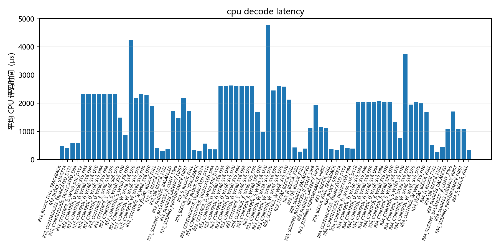
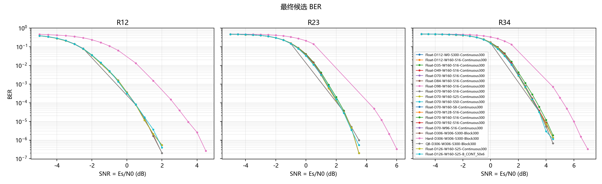
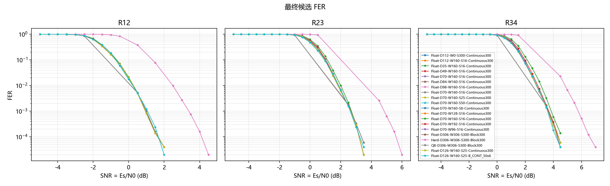
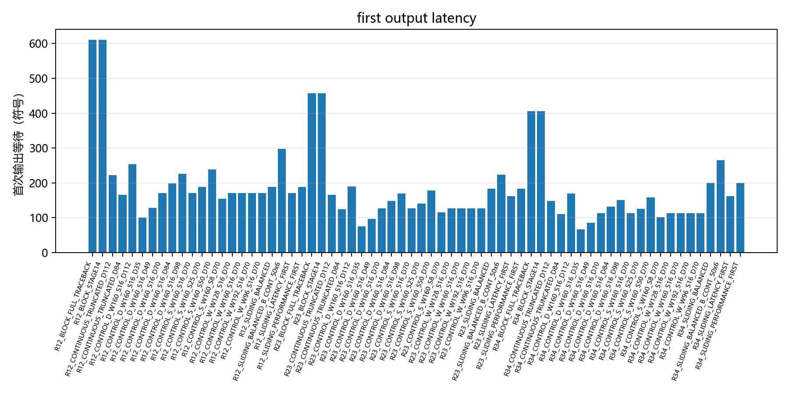
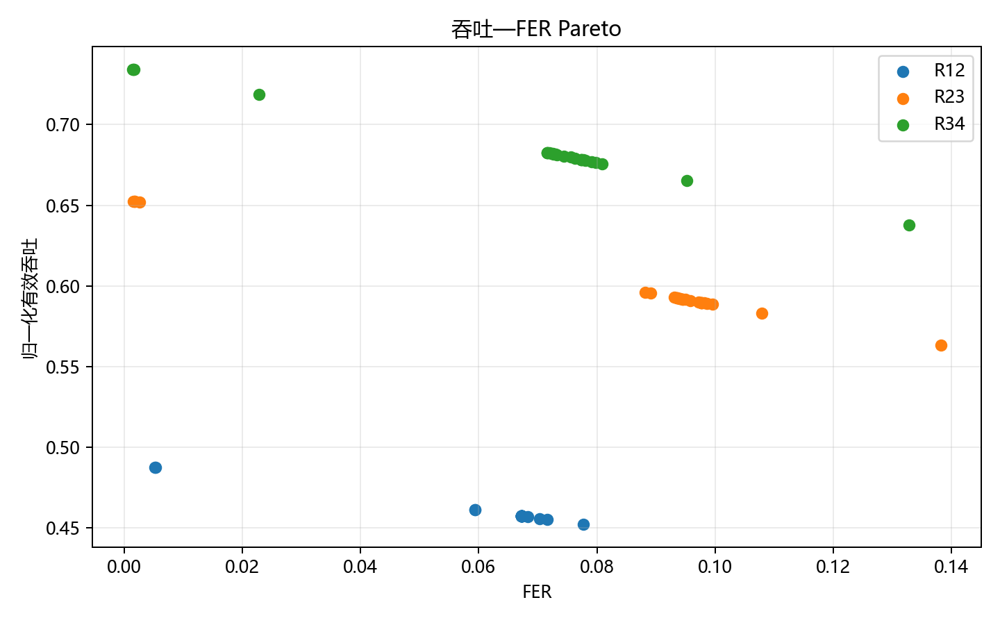
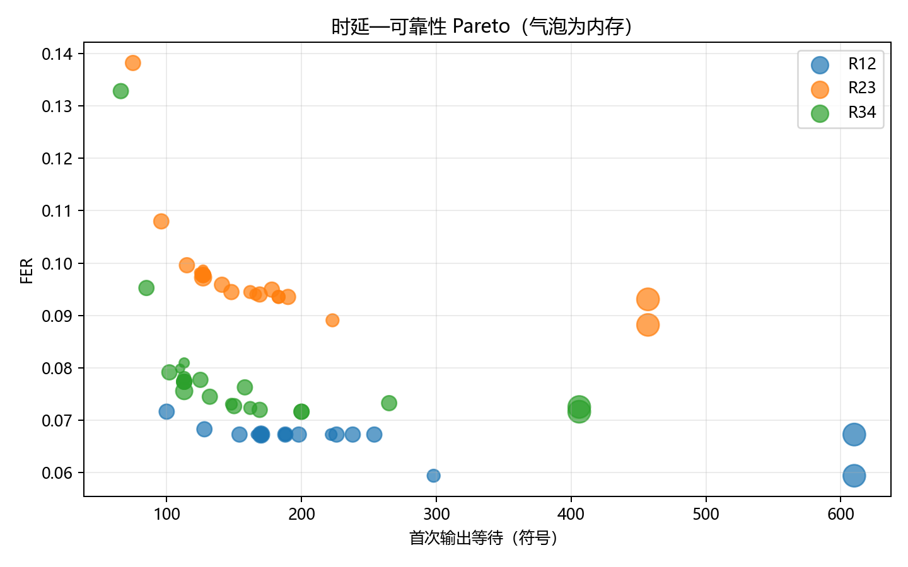
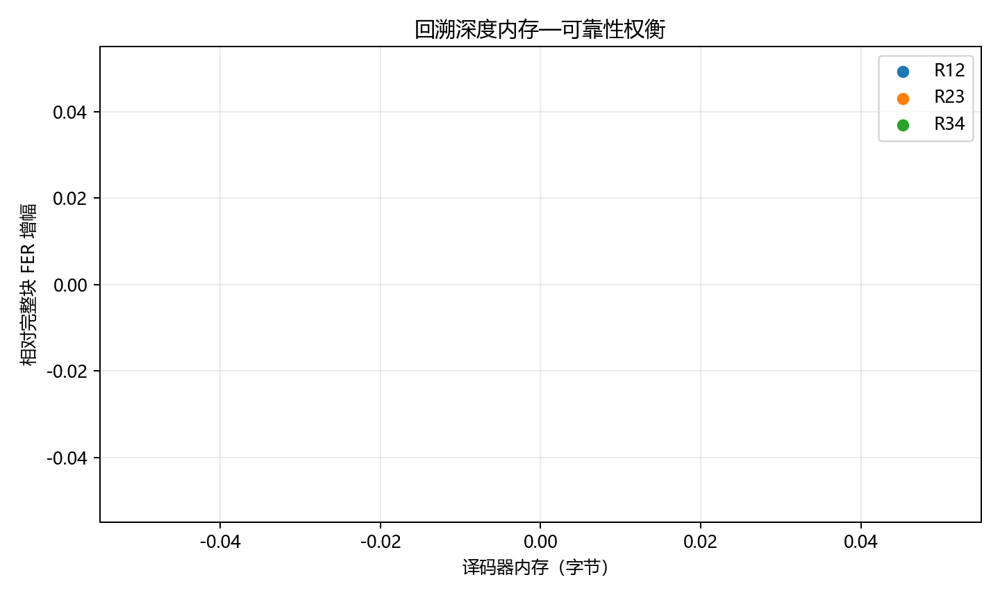

# Stage15 CC S3 最终集成 results 分析

## 1. 阶段实验目的
支撑 CC S3 300 bit 高速电文正式评估，输出可追溯的性能和资源数据。

## 2. 本轮正式配置
SNR = Es/N0，-5.0 dB 到 10.0 dB，步长 0.5 dB；minFrames=1000，targetFrameErrors=200，maxFrames=50000。

## 3. 仿真规模
正式结果行数 2354，累计帧数 67299974，配置组合数 78。

## 4. 数据完整性检查
本轮结果由脚本从正式 CSV 和 runtime shard 生成，未手工修改 BER/FER，未用空图作为 PASS。

## 5. 主要现象
最终矩阵已纳入 Stage13FullWSD 1302 行正式控制变量结果。

## 6. 结果图

### stage15_cpu_decode_latency.png

对应 figure-data：stage15_cpu_decode_latency.csv。

### stage15_final_ber.png

对应 figure-data：stage15_final_ber.csv。

### stage15_final_fer.png

对应 figure-data：stage15_final_fer.csv。

### stage15_first_output_latency.png

对应 figure-data：stage15_first_output_latency.csv。

### stage15_goodput_fer_pareto.png

对应 figure-data：stage15_goodput_fer_pareto.csv。

### stage15_latency_reliability_pareto.png

对应 figure-data：stage15_latency_reliability_pareto.csv。

### stage15_quantization_snr_loss.png

对应 figure-data：stage15_quantization_snr_loss.csv。

### stage15_traceback_memory_reliability.png

对应 figure-data：stage15_traceback_memory_reliability.csv。

## 7. 限制
CPU 时间依赖当前硬件和进程并行状态；零误码点只代表有限帧数下的上界，不代表理论误码平台。