# Stage15 结果分析

本轮最终矩阵共 3447 行，其中 Stage14 Hard/Soft 四组织全量纳入。
12 张核心图均有对应 `figure_data/*.csv`，没有空图。BER/FER 的零错误正式点保留
在 figure-data 与源 CSV 中，但在对数纵轴上直接省略，避免制造高 SNR error floor。

- Block Soft BER/FER：三码率分图/分线，避免混入 W/S/D 全候选。
- Block Hard/Soft：每码率仅两条曲线，直接给出判决增益。
- Slot Soft/Hard：每码率四条组织曲线，保留 100x3 与 150x2。
- 时延图：只比较四组织和三码率；首次输出、平均与 P95 分开展示。
- 量化图：Q3 至 Q8 在 FER=0.1 的损失；Q8 范围
  -0.001 至 0.008 dB。
- 回溯图：真实筛选值为 `FER_010` 与
  `CONTINUOUS_TRUNCATED_VITERBI`，有效点恰为 18。
- Pareto 图只保留少量 Block Float、Stage13 balanced、50x6 Soft 代表点。

推荐先在同目标 FER=0.1 下比较所需 SNR、时延、内存和 CPU；若曲线不覆盖目标则
排除。吞吐与可靠性推荐另在固定 Es/N0=2.0 dB 比较。限制：离散点插值不替代新增
dense 仿真，且不同码率的同 SNR 比较不等价于同净吞吐比较。

## 十二张核心图

### stage15_block_soft_ber_by_rate.png

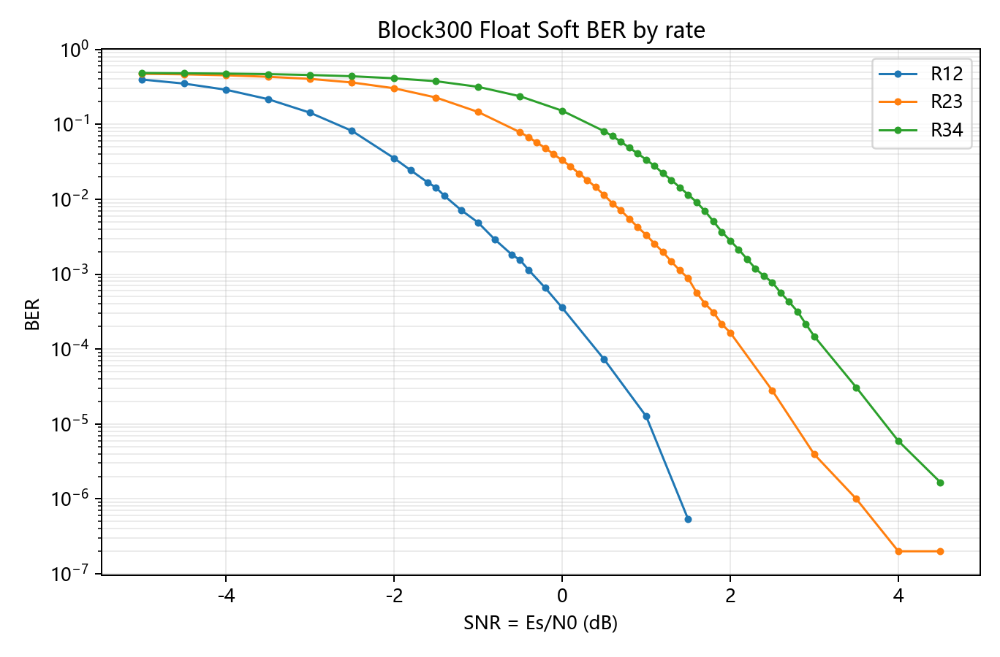

figure-data 共 141 行；`dtb` 从 306 到 306，`window` 从 306 到 306。结论：该图只保留标题指定的比较变量，避免候选过载。限制：只解释正式 CSV 覆盖的工作区间。

### stage15_block_soft_fer_by_rate.png

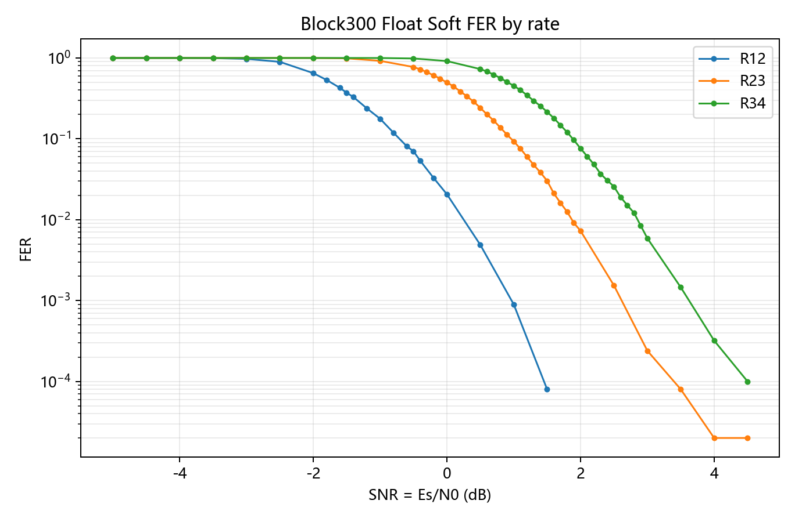

figure-data 共 141 行；`dtb` 从 306 到 306，`window` 从 306 到 306。结论：该图只保留标题指定的比较变量，避免候选过载。限制：只解释正式 CSV 覆盖的工作区间。

### stage15_block_hard_soft_fer.png

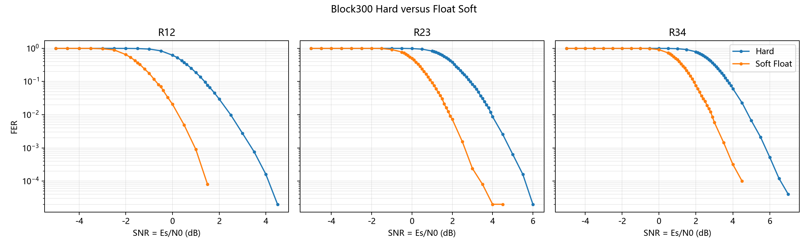

figure-data 共 282 行；`dtb` 从 306 到 306，`window` 从 306 到 306。结论：该图只保留标题指定的比较变量，避免候选过载。限制：只解释正式 CSV 覆盖的工作区间。

### stage15_slot_soft_fer.png

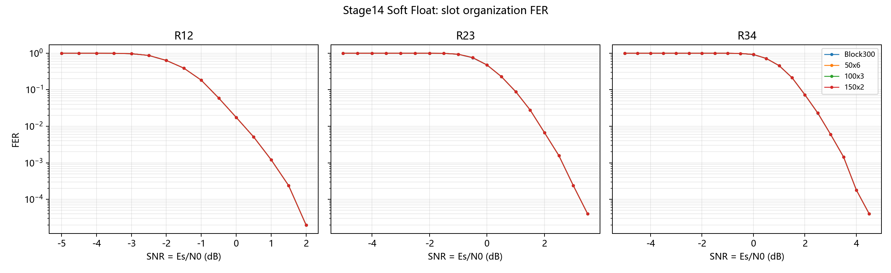

figure-data 共 372 行；`dtb` 从 70 到 306，`window` 从 128 到 306。结论：该图只保留标题指定的比较变量，避免候选过载。限制：只解释正式 CSV 覆盖的工作区间。

### stage15_slot_hard_fer.png

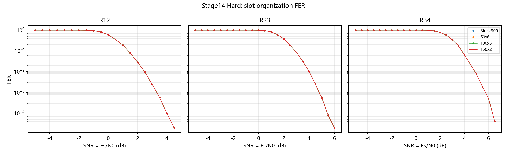

figure-data 共 372 行；`quantBits` 从 1 到 1，`dtb` 从 70 到 306。结论：该图只保留标题指定的比较变量，避免候选过载。限制：只解释正式 CSV 覆盖的工作区间。

### stage15_slot_soft_goodput.png

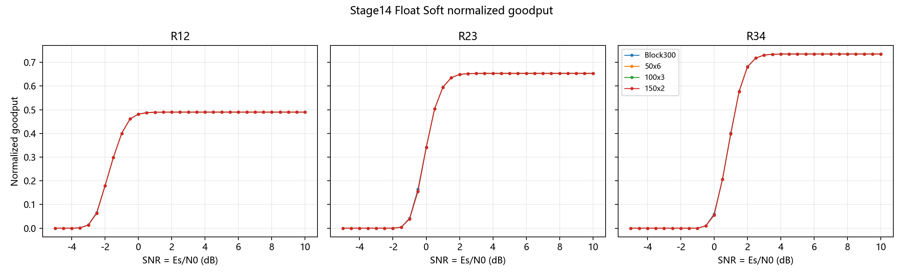

figure-data 共 372 行；`dtb` 从 70 到 306，`window` 从 128 到 306。结论：该图只保留标题指定的比较变量，避免候选过载。限制：只解释正式 CSV 覆盖的工作区间。

### stage15_slot_first_output_latency.png

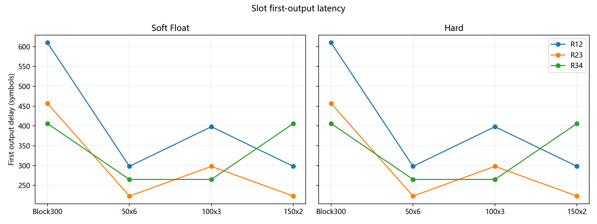

figure-data 共 24 行；`firstOutputDelaySymbols` 从 223 到 610，`avgDecisionDelaySymbols` 从 171.167 到 311。结论：该图只保留标题指定的比较变量，避免候选过载。限制：只解释正式 CSV 覆盖的工作区间。

### stage15_slot_avg_p95_latency.png

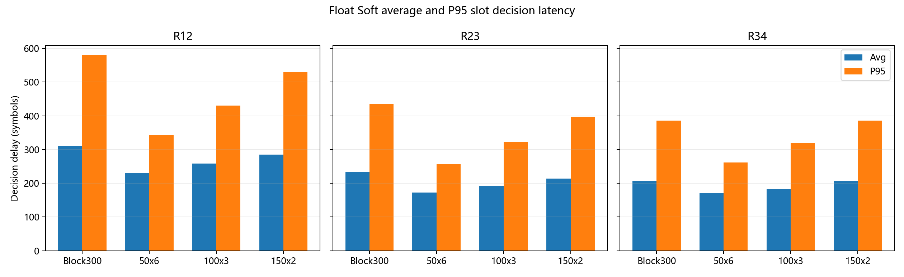

figure-data 共 12 行；`firstOutputDelaySymbols` 从 223 到 610，`avgDecisionDelaySymbols` 从 171.167 到 311。结论：该图只保留标题指定的比较变量，避免候选过载。限制：只解释正式 CSV 覆盖的工作区间。

### stage15_quantization_snr_loss.png

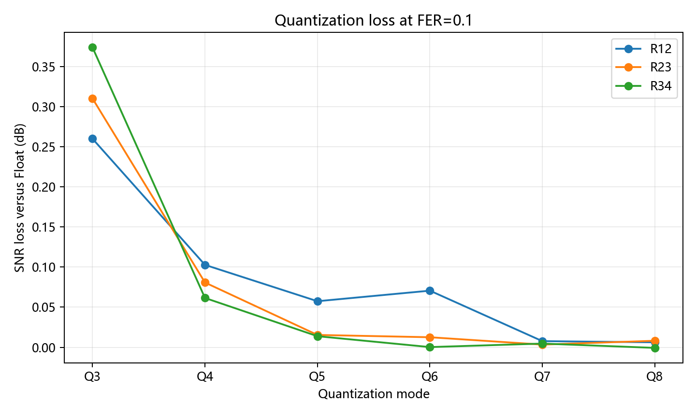

figure-data 共 18 行；`targetFer` 从 0.1 到 0.1，`leftSnr` 从 -1 到 2。结论：该图只保留标题指定的比较变量，避免候选过载。限制：只解释正式 CSV 覆盖的工作区间。

### stage15_traceback_memory_reliability.png

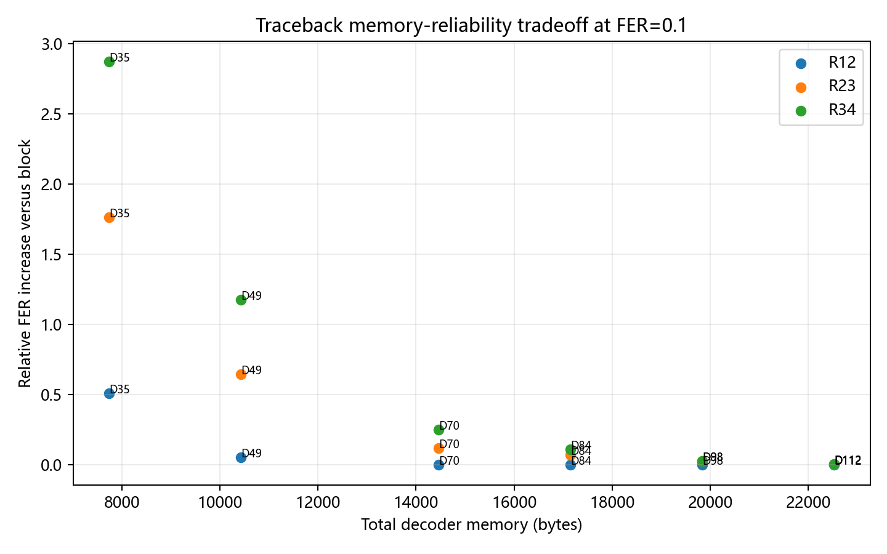

figure-data 共 18 行；`targetFer` 从 0.1 到 0.1，`snrDb` 从 -0.6 到 1.9。结论：该图只保留标题指定的比较变量，避免候选过载。限制：只解释正式 CSV 覆盖的工作区间。

### stage15_sliding_parameter_summary.png

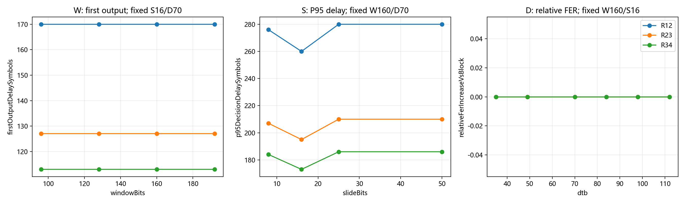

figure-data 共 42 行；`windowBits` 从 96 到 192，`firstOutputDelaySymbols` 从 113 到 170。结论：该图只保留标题指定的比较变量，避免候选过载。限制：只解释正式 CSV 覆盖的工作区间。

### stage15_latency_reliability_pareto.png

figure-data 共 9 行；`targetFer` 从 0.1 到 0.1，`FER` 从 0.1 到 0.1。结论：该图只保留标题指定的比较变量，避免候选过载。限制：只解释正式 CSV 覆盖的工作区间。
