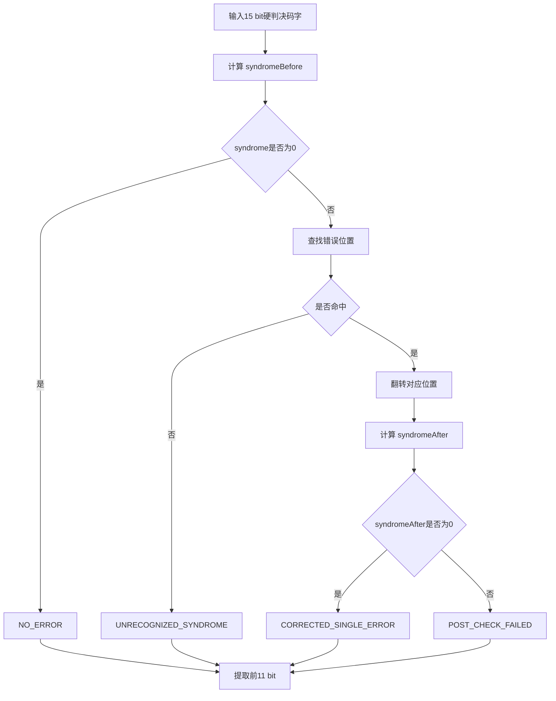
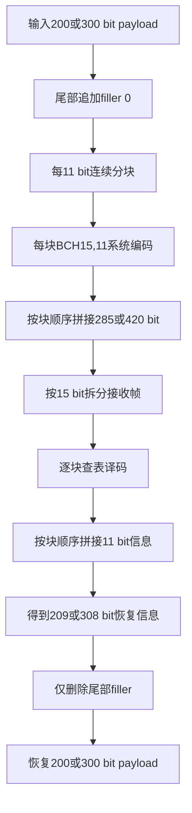

<h1 align="center">

项目记录

</h1>


---


[Toc]


----
# SCL_Channel_Coding_Design 公共仿真基础项目记录

## 1. 项目概述

本阶段完成三类信道编码 BCH、卷积码和 LDPC 共用的仿真基础模块，统一随机帧、标准高斯噪声、BPSK、AWGN、硬判决、LLR、BER/FER、时延、停止条件、断点恢复、分片合并、结果文件和绘图流程。

公共仿真链路如下：

随机电文帧  
→ 编码器接口  
→ BPSK 调制  
→ AWGN 信道  
→ 硬判决或 LLR  
→ 译码器接口  
→ 电文恢复  
→ BER、FER、成功率和时延统计  
→ CSV、JSON 和 PNG 输出

本阶段只完成公共模块，不实现 BCH、卷积码、LDPC 和交织算法。

---

## 2. 阶段划分

| 阶段 | 主要内容 | 最终状态 |
|---|---|---|
| Common-02 | 公共类型、长度、接口和码率定义 | PASS |
| Common-03 | 确定性公共电文帧池 | PASS |
| Common-04 | 公共随机噪声、信道、统计、断点恢复和集成仿真 | PASS |
| main 合并 | Common-04 合并到主分支 | 已完成 |

最终主分支合并提交：

`3bb5d9acf0bcac75b3f2bc796f39f083bdd96dd6`

Common-04 最终功能提交：

`d6c1cbed2c901b2f16c299352b8a9d98f0abcbed`

Common-04 最终审计修正提交：

`2cb13d2e1b54ec4f56ebed46f256738df2c2bd46`

---

## 3. Common-02：公共类型与接口

### 3.1 实验目的

统一三类编码后续使用的数据类型、长度定义、编码器接口、译码器接口和码率计算方法，防止不同编码模块各自定义一套不一致的规则。

### 3.2 核心定义

码率统一定义为：

$$
R=\frac{\text{原始输入长度}}{\text{编码后长度}}
$$

例如：

$$
R=\frac{200}{248}\approx 0.80645
$$

统一长度结构包括：

- `payloadLength`：原始输入长度；
- `codecInputLength`：编码器实际输入长度；
- `encodedLength`：编码后长度；
- `transmittedLength`：实际发送长度。

BER 和 FER 最终只比较原始 payload 与恢复后的 payload，不统计填充位、校验位、尾比特和 filler。

### 3.3 实验方法

1. 建立统一的 bit、LLR、帧序号和 SNR 数据类型。
2. 建立编码器、译码器和帧读取接口。
3. 建立长度合法性检查。
4. 建立统一码率计算函数。
5. 使用正常输入和异常输入进行测试。

### 3.4 主要优化

- 禁止各编码模块重复定义码率。
- 明确区分原始 payload 长度和编码器内部输入长度。
- 统一软判决和硬判决输入结构。
- 为后续 BCH、卷积码和 LDPC 保留统一接入接口。

### 3.5 实验结果

| 检查项 | 结果 |
|---|---|
| 公共类型定义 | PASS |
| 长度合法性检查 | PASS |
| 码率定义 | PASS |
| 编码器接口 | PASS |
| 译码器接口 | PASS |
| 异常输入检查 | PASS |
| 最终 Gate | `PASS_COMMON_TYPES_INTERFACES` |

### 3.6 主要文件位置

| 内容 | 文件位置 |
|---|---|
| 公共类型 | `Task/Common/include/common/types.hpp` |
| 公共帧结构 | `Task/Common/include/common/frame.hpp` |
| 编译码接口 | `Task/Common/include/common/interfaces.hpp` |
| 译码输入结构 | `Task/Common/include/common/decoder_input.hpp` |
| 结果类型 | `Task/Common/include/common/result_types.hpp` |
| 汇总头文件 | `Task/Common/include/common/common.hpp` |
| 自动检查脚本 | `Task/Common/scripts/check_common02.py` |
| 阶段记录 | `Task/Common/stages/stage02_common_types_interfaces/` |

---

## 4. Common-03：公共电文帧池

### 4.1 实验目的

建立 BCH、卷积码和 LDPC 共用的确定性 payload 帧池，使三类编码能够使用完全相同的原始电文进行公平比较。

### 4.2 主要参数

| 参数 | 数值 |
|---|---:|
| 支持 payload 长度 | 200 bit、300 bit |
| 最大帧数 | 50000 |
| 默认每个 shard 帧数 | 1000 |
| bit 存储方式 | packed bits |
| bit 顺序 | LSB first |
| payload 算法 | `splitmix64_payload_v2` |
| manifest schema | v2 |
| 完整性校验 | SHA256 |
| 全局身份 | overallHash |

### 4.3 实验方法

1. 使用固定 payload seed。
2. 根据 seed、payloadLength 和 frameIndex 生成 payload。
3. 将 bit 按字节压缩保存。
4. 每 1000 帧形成一个 shard。
5. 为每个 shard 计算 SHA256。
6. 根据 manifest 内容计算 overallHash。
7. C++ 使用 `PackedFramePoolReader` 随机读取指定帧。
8. Python 重新生成同样帧池并进行字节级比较。

### 4.4 优化内容

- payload 与噪声使用不同随机域。
- 帧内容不依赖当前时间、线程或执行顺序。
- 同一 seed 重复生成时文件完全一致。
- 支持最大 50000 帧，不通过重复 1000 帧伪造。
- reader 默认验证 shard SHA256。
- 支持跨 shard 边界随机读取。
- manifest 不包含绝对路径、用户名和时间戳。

### 4.5 实验结果

| 检查项 | 结果 |
|---|---|
| K=200 帧生成 | PASS |
| K=300 帧生成 | PASS |
| 同 seed 重复生成 | 完全一致 |
| 不同 seed 数据变化 | PASS |
| C++/Python 帧内容一致 | PASS |
| shard SHA256 校验 | PASS |
| overallHash 校验 | PASS |
| shard gap 检查 | PASS |
| shard overlap 检查 | PASS |
| 文件截断检查 | PASS |
| 字节损坏检查 | PASS |
| 越界读取检查 | PASS |
| 最终 Gate | `PASS_COMMON_FRAME_POOL` |

### 4.6 主要文件位置

| 内容 | 文件位置 |
|---|---|
| 帧池接口与读取器 | `Task/Common/include/common/frame_pool.hpp` |
| 帧池生成脚本 | `Task/Common/scripts/generate_common03_frame_pool.py` |
| 帧池检查脚本 | `Task/Common/scripts/check_common03.py` |
| 帧池审计记录 | `Task/Common/stages/stage03_common_frame_pool/` |

---

## 5. Common-04：公共仿真基础

### 5.1 实验目的

一次性完成三类编码后续共用的信道仿真基础，避免 BCH、卷积码和 LDPC 分别实现噪声、调制、统计和绘图，保证三类编码仿真结果可复现、可比较、可恢复。

### 5.2 总体参数

#### Smoke 参数

| 参数 | 数值 |
|---|---|
| payload 长度 | 200、300 |
| 帧数 | 100 |
| Eb/N0 | 0、2、4 dB |
| 判决方式 | HARD、LLR_SIGN |
| 输入方式 | pool-backed |

#### Prescan 参数

| 参数 | 数值 |
|---|---|
| payload 长度 | 200、300 |
| 帧数 | 2000 |
| Eb/N0 | 0、1、2、3、4、5、6 dB |
| 判决方式 | HARD、LLR_SIGN |
| 输入方式 | pool-backed |

#### Formal 容量参数

| 参数 | 数值 |
|---|---:|
| 最大帧数 | 50000 |
| 每帧最大噪声样本数 | 1000 |
| 每个 shard 帧数 | 1000 |
| shard 数量 | 50 |
| 最小运行帧数 | 5000 |
| 最大运行帧数 | 50000 |
| 目标错误帧数 | 200 |
| 预计噪声 payload 大小 | 400000000 byte |

正式容量计算：

$$
50000\times1000\times8=400000000\ \text{byte}
$$

本阶段只验证容量规划，不生成或提交完整 400 MB 噪声池。

---

## 6. 公共随机策略与高斯噪声

### 6.1 实验目的

保证每一帧重新生成独立噪声，同时保证同一配置可以完全复现。

### 6.2 NoiseKey

标准随机 key 由以下字段组成：

- `masterNoiseSeed`
- `noiseGroupId`
- `frameIndex`
- `symbolIndex`
- `noisePolicyVersion`

噪声 key 不包含：

- Eb/N0；
- SNR 序号；
- codeType；
- decoderType；
- 当前时间；
- 线程编号；
- 进程编号；
- 执行顺序。

### 6.3 标准高斯噪声

首先生成标准母噪声：

$$
z_{f,i}\sim\mathcal{N}(0,1)
$$

不同 SNR 只改变噪声缩放系数：

$$
n_{f,i}=\sigma z_{f,i}
$$

同一 frame 和 symbol 在不同 SNR 下使用相同的标准母噪声。

### 6.4 生成方法

随机生成流程：

SplitMix64  
→ 开区间均匀随机数  
→ Box-Muller  
→ 标准高斯样本

未使用 `std::normal_distribution`，避免不同 C++ 标准库产生不同结果。

### 6.5 噪声池格式

| 字段 | 说明 |
|---|---|
| 数据精度 | float64 |
| 字节序 | little-endian |
| 排列方式 | frame-major |
| shard magic | `SCLN04` |
| schema | `common04.noise_pool_manifest.v1` |
| 生成算法 | `splitmix64_box_muller_v1` |
| 完整性检查 | shard SHA256 + overallHash |

### 6.6 实验结果

| 检查项 | 结果 |
|---|---|
| 相同 NoiseKey 输出一致 | PASS |
| 不同 frame 输出不同 | PASS |
| 不同 symbol 输出不同 | PASS |
| 不同 seed 输出不同 | PASS |
| SNR 不进入随机 key | PASS |
| C++/Python uint64 一致 | PASS |
| C++/Python Gaussian 一致 | PASS |
| 高斯均值 sanity check | PASS |
| 高斯方差 sanity check | PASS |
| NaN/Inf 检查 | 0 |
| noise shard header 检查 | PASS |
| SHA256 检查 | PASS |
| shard 边界读取 | PASS |
| 最终 Gate | `PASS_COMMON_GAUSSIAN_NOISE` |

---

## 7. BPSK、AWGN 与 LLR

### 7.1 BPSK 映射

$$
b=0\Rightarrow x=+1
$$

$$
b=1\Rightarrow x=-1
$$

### 7.2 码率

$$
R=\frac{K}{N}
$$

其中：

- $K$ 为原始输入长度；
- $N$ 为编码后实际发送长度。

测试用例包括：

$$
R=\frac{200}{248}
$$

$$
R=\frac{300}{390}
$$

真正的 identity baseline 使用：

$$
R=1
$$

### 7.3 AWGN 参数

$$
\gamma_b=10^{E_b/N_0(\mathrm{dB})/10}
$$

$$
\sigma^2=\frac{1}{2R\gamma_b}
$$

$$
\sigma=\sqrt{\frac{1}{2R\gamma_b}}
$$

接收信号：

$$
y_i=x_i+\sigma z_i
$$

### 7.4 硬判决

$$
\hat b_i=
\begin{cases}
1,&y_i<0\\
0,&y_i\geq0
\end{cases}
$$

### 7.5 LLR

$$
LLR_i=\frac{2y_i}{\sigma^2}
$$

判决规则：

$$
LLR_i>0\Rightarrow \hat b_i=0
$$

$$
LLR_i<0\Rightarrow \hat b_i=1
$$

### 7.6 实验结果

| 检查项 | 结果 |
|---|---|
| BPSK 0→+1 | PASS |
| BPSK 1→-1 | PASS |
| y=0 判为 bit 0 | PASS |
| 码率 200/248 | PASS |
| 码率 300/390 | PASS |
| sigma 公式 | PASS |
| LLR 公式 | PASS |
| HARD 与 LLR_SIGN 一致 | PASS |
| C++/Python 对比 | `mismatchCount=0` |
| 最终 Gate | `PASS_COMMON_BPSK_AWGN_LLR` |

---

## 8. BER、FER、成功率与时延

### 8.1 BER

$$
BER=
\frac{\text{恢复 payload 中的错误 bit 数}}
{\text{已比较的 payload bit 总数}}
$$

### 8.2 FER

一帧 payload 只要存在一个错误 bit，则该帧记为错误帧。

$$
FER=
\frac{\text{错误帧数}}
{\text{处理帧数}}
$$

### 8.3 成功率

$$
SuccessRate=
\frac{\text{完全正确的 payload 帧数}}
{\text{处理帧数}}
$$

无 CRC 条件下：

$$
SuccessRate=1-FER
$$

### 8.4 时延字段

使用 `std::chrono::steady_clock` 实际测量：

- 编码时延；
- 信道处理时延；
- 判决或译码时延；
- payload 恢复时延；
- 总时延；
- 最大译码时延；
- 最大总时延。

### 8.5 停止条件

正式实验停止条件：

达到最大帧数，或者同时满足：

$$
N_{\mathrm{frame}}\geq N_{\min}
$$

$$
N_{\mathrm{FE}}\geq N_{\mathrm{target}}
$$

默认 formal 模板：

| 参数 | 数值 |
|---|---:|
| `minFrames` | 5000 |
| `maxFrames` | 50000 |
| `targetFrameErrors` | 200 |

### 8.6 实验结果

| 检查项 | 结果 |
|---|---|
| payload-only BER | PASS |
| payload-only FER | PASS |
| successRate | PASS |
| 计数一致性 | PASS |
| 空结果拒绝 | PASS |
| 时延实际测量 | PASS |
| 平均时延 | PASS |
| 最大时延 | PASS |
| 停止条件边界 | PASS |
| 最终 Gate | `PASS_COMMON_METRICS_CONTROL` |

---

## 9. Checkpoint/Resume

### 9.1 实验目的

支持正式长时间实验中断后继续运行，避免实验因程序关闭或机器中断而全部重跑。

### 9.2 Checkpoint 记录内容

- experimentId；
- configHash；
- framePoolId；
- noisePoolId；
- payloadLength；
- encodedLength；
- snrIndex；
- Eb/N0；
- nextFrameIndex；
- processedFrames；
- bitErrors；
- frameErrors；
- successfulFrames；
- 时延累计值；
- stopReason。

### 9.3 实验方法

连续运行：

100 帧一次性完成。

恢复运行：

37 帧  
→ 写入 checkpoint  
→ 读取 checkpoint  
→ 从第 38 帧继续  
→ 恢复到 100 帧。

### 9.4 实验结果

| 比较项 | 连续运行 | Resume 运行 | 结果 |
|---|---:|---:|---|
| processedFrames | 100 | 100 | 一致 |
| totalPayloadBits | 一致 | 一致 | PASS |
| bitErrors | 一致 | 一致 | PASS |
| frameErrors | 一致 | 一致 | PASS |
| successfulFrames | 一致 | 一致 | PASS |
| stopReason | 一致 | 一致 | PASS |
| final nextFrameIndex | 100 | 100 | PASS |

负向测试包括：

- schema 不一致；
- experimentId 不一致；
- configHash 不一致；
- framePoolId 不一致；
- noisePoolId 不一致；
- payloadLength 不一致；
- encodedLength 不一致；
- SNR 不一致；
- nextFrameIndex 越界；
- 计数矛盾；
- checkpoint JSON 损坏。

最终 Gate：

`PASS_COMMON_CHECKPOINT_RESULTS`

---

## 10. 分片运行与合并

### 10.1 实验目的

将正式实验拆成多个 frame shard，支持分段运行、断点保存和后续结果合并。

### 10.2 合并检查

C++ 和 Python 均检查：

- shardIndex；
- frameStart；
- frameCount；
- gap；
- overlap；
- duplicate；
- experimentId；
- configHash；
- framePoolId；
- noisePoolId；
- payloadLength；
- encodedLength；
- Eb/N0；
- snrIndex；
- processedFrames；
- totalPayloadBits；
- successfulFrames 与 frameErrors。

### 10.3 合并规则

计数与时延累计值求和：

$$
S_{\mathrm{merged}}=\sum_{j=1}^{M}S_j
$$

最大时延取最大值：

$$
T_{\max,\mathrm{merged}}=\max_j T_{\max,j}
$$

平均时延重新计算：

$$
T_{\mathrm{avg}}=
\frac{T_{\mathrm{sum}}}
{N_{\mathrm{processed}}}
$$

### 10.4 实验结果

固定测试分片：

| Shard | frameStart | frameCount |
|---|---:|---:|
| shard 0 | 0 | 40 |
| shard 1 | 40 | 60 |
| 合并 | 0 | 100 |

C++ 和 Python 合并结果：

| 指标 | C++ | Python | 结果 |
|---|---:|---:|---|
| processedFrames | 100 | 100 | PASS |
| totalPayloadBits | 20000 | 20000 | PASS |
| bitErrors | 100 | 100 | PASS |
| frameErrors | 100 | 100 | PASS |
| totalTimeNsSum | 10000 | 10000 | PASS |
| maxTotalTimeNs | 101 | 101 | PASS |
| avgTotalTimeUs | 0.1 | 0.1 | PASS |

---

## 11. Identity 集成实验

### 11.1 实验目的

在不实现具体编码器的情况下，验证完整公共链路：

Common-03 frame pool  
→ identity encode  
→ BPSK  
→ Common-04 noise pool  
→ AWGN  
→ HARD/LLR_SIGN  
→ identity recover  
→ BER/FER  
→ CSV/JSON/PNG

Identity baseline 使用：

$$
N=K
$$

$$
R=1
$$

### 11.2 No-noise 实验

测试：

- K=200 HARD；
- K=300 HARD；
- K=200 finite LLR；
- K=300 finite LLR。

有限 LLR 设置：

$$
x=+1\Rightarrow LLR=+100
$$

$$
x=-1\Rightarrow LLR=-100
$$

实验结果：

| K | 判决方式 | BER | FER | SuccessRate |
|---:|---|---:|---:|---:|
| 200 | HARD | 0 | 0 | 1 |
| 300 | HARD | 0 | 0 | 1 |
| 200 | finite LLR_SIGN | 0 | 0 | 1 |
| 300 | finite LLR_SIGN | 0 | 0 | 1 |

### 11.3 Smoke 和 Prescan

| 实验 | 帧数 | Eb/N0 | K | 判决 |
|---|---:|---|---|---|
| Smoke | 100 | 0、2、4 dB | 200、300 | HARD、LLR_SIGN |
| Prescan | 2000 | 0～6 dB | 200、300 | HARD、LLR_SIGN |

验证结果：

- HARD 与 LLR_SIGN 的误码计数一致；
- 高 SNR BER 总体低于低 SNR；
- CSV 可解析；
- metadata 含真实 framePoolId 和 noisePoolId；
- PNG 文件成功生成；
- 不要求短样本曲线逐点严格单调。

最终 Gate：

`PASS_COMMON_INTEGRATION`

---

## 12. 结果文件和图片

### 12.1 标准结果字段

`summary.csv` 包含：

- experimentId；
- codeType；
- caseName；
- payloadLength；
- encodedLength；
- codeRate；
- Eb/N0；
- processedFrames；
- totalPayloadBits；
- bitErrors；
- frameErrors；
- successfulFrames；
- BER；
- FER；
- successRate；
- 平均时延；
- 最大时延；
- stopReason；
- framePoolId；
- noisePoolId；
- configHash。

### 12.2 图片

公共绘图工具输出：

| 图片 | 内容 |
|---|---|
| `ber_vs_ebn0.png` | BER 曲线 |
| `fer_vs_ebn0.png` | FER 曲线 |
| `success_rate_vs_ebn0.png` | 成功率曲线 |
| `avg_decode_time_vs_ebn0.png` | 平均判决或译码时延 |
| `max_decode_time_vs_ebn0.png` | 最大判决或译码时延 |
| `avg_total_time_vs_ebn0.png` | 平均总时延 |

BER 和 FER 使用对数纵轴。

### 12.3 项目记录插图位置

实际运行生成图片位于：

`Task/Common/build/stage04/real_pool_runs/smoke/plots/`

`Task/Common/build/stage04/real_pool_runs/prescan/plots/`

项目记录中可插入：


说明：`build/` 为本地生成目录，不提交 Git。图片路径需要根据项目记录文件实际存放位置调整。

---

## 13. 程序与函数位置

### 13.1 随机和噪声

| 功能 | 函数或类 | 文件 |
|---|---|---|
| 噪声 key | `NoiseKey` | `Task/Common/include/common/random_policy.hpp` |
| 随机 word | `noiseUniformWord()` | `Task/Common/src/random_policy.cpp` |
| 高斯样本 | `standardGaussianSample()` | `Task/Common/src/gaussian_noise.cpp` |
| 每帧噪声 | `generateStandardGaussianFrame()` | `Task/Common/src/gaussian_noise.cpp` |
| 噪声池生成 | `generateNoisePool()` | `Task/Common/src/noise_pool.cpp` |
| 噪声池读取 | `NoisePoolReader` | `Task/Common/src/noise_pool.cpp` |

### 13.2 调制、信道与判决

| 功能 | 函数 | 文件 |
|---|---|---|
| BPSK 单符号 | `bpskSymbol()` | `Task/Common/src/modulation.cpp` |
| BPSK 向量 | `bpskModulate()` | `Task/Common/src/modulation.cpp` |
| Eb/N0 转线性值 | `ebN0Linear()` | `Task/Common/src/awgn_channel.cpp` |
| sigma 计算 | `computeAwgnSigma()` | `Task/Common/src/awgn_channel.cpp` |
| AWGN | `applyAwgn()` | `Task/Common/src/awgn_channel.cpp` |
| 硬判决 | `hardDecision()` | `Task/Common/src/demodulation.cpp` |
| LLR | `computeLlr()` | `Task/Common/src/demodulation.cpp` |
| LLR 符号判决 | `llrSignDecision()` | `Task/Common/src/demodulation.cpp` |

### 13.3 指标、停止和恢复

| 功能 | 函数或类 | 文件 |
|---|---|---|
| 误码统计 | `ErrorMetrics` | `Task/Common/include/common/simulation_metrics.hpp` |
| 帧结果累加 | `addFrameResult()` | `Task/Common/src/simulation_metrics.cpp` |
| 停止判断 | `evaluateStop()` | `Task/Common/src/simulation_control.cpp` |
| 正式停止配置 | `formalStopConfig()` | `Task/Common/src/simulation_control.cpp` |
| checkpoint 结构 | `SimulationCheckpointRecord` | `Task/Common/include/common/checkpoint.hpp` |
| checkpoint 写入 | `writeCheckpointFile()` | `Task/Common/src/checkpoint.cpp` |
| checkpoint 读取 | `readCheckpointFile()` | `Task/Common/src/checkpoint.cpp` |
| resume 检查 | `validateResumeCompatibility()` | `Task/Common/src/checkpoint.cpp` |

### 13.4 集成和结果

| 功能 | 函数或类 | 文件 |
|---|---|---|
| identity 仿真 | `runIdentitySimulation()` | `Task/Common/src/simulation_pipeline.cpp` |
| shard 合并 | `mergeSimulationShards()` | `Task/Common/src/simulation_pipeline.cpp` |
| summary 行 | `SummaryRow` | `Task/Common/include/common/result_schema.hpp` |
| CSV 输出 | `summaryRowToCsv()` | `Task/Common/src/result_schema.cpp` |
| metadata 输出 | `metadataJson()` | `Task/Common/src/result_schema.cpp` |
| Python shard 合并 | — | `Task/Common/scripts/merge_common04_shards.py` |
| 公共绘图 | — | `Task/Common/scripts/plot_common_results.py` |
| C++/Python 对比 | — | `Task/Common/scripts/compare_common04_cpp_python.py` |
| 总检查器 | — | `Task/Common/scripts/check_common04.py` |

---

## 14. 测试与审计文件

| 内容 | 文件位置 |
|---|---|
| G1 随机测试 | `Task/Common/tests/stage04/test_common04_random_policy.cpp` |
| G2 高斯噪声测试 | `Task/Common/tests/stage04/test_common04_gaussian_noise.cpp` |
| G3 调制信道测试 | `Task/Common/tests/stage04/test_common04_modulation_awgn.cpp` |
| G4 指标停止测试 | `Task/Common/tests/stage04/test_common04_metrics_control.cpp` |
| G5 checkpoint 测试 | `Task/Common/tests/stage04/test_common04_checkpoint.cpp` |
| G6 集成测试 | `Task/Common/tests/stage04/test_common04_integration.cpp` |
| identity runner | `Task/Common/tests/stage04/common04_identity_runner.cpp` |
| C++ reference runner | `Task/Common/tests/stage04/common04_reference_runner.cpp` |
| 验收矩阵 | `Task/Common/stages/stage04_common_simulation_foundation/acceptance_matrix.csv` |
| 参数冻结 | `Task/Common/stages/stage04_common_simulation_foundation/frozen_config.csv` |
| C++/Python 对比 | `Task/Common/stages/stage04_common_simulation_foundation/cpp_python_comparison.csv` |
| No-noise 结果 | `Task/Common/stages/stage04_common_simulation_foundation/no_noise_identity_results.csv` |
| shard 对比 | `Task/Common/stages/stage04_common_simulation_foundation/shard_merge_comparison.csv` |
| formal 容量 | `Task/Common/stages/stage04_common_simulation_foundation/formal_capacity_validation.csv` |
| 负向测试 | `Task/Common/stages/stage04_common_simulation_foundation/negative_test_results.csv` |
| 验证报告 | `Task/Common/stages/stage04_common_simulation_foundation/validation_report.md` |
| 审计清单 | `Task/Common/stages/stage04_common_simulation_foundation/manifest.json` |

---

## 15. 主要优化总结

1. 统一码率为原始输入长度除以编码后长度。
2. payload、填充位和编码校验位严格区分。
3. 公共帧池和噪声池均可确定性复现。
4. 每一帧使用独立随机噪声，不复制旧帧噪声。
5. 同一帧在不同 SNR 下使用相同标准母噪声。
6. C++ 与 Python 使用统一随机和信道参考。
7. identity baseline 改为真正的 R=1。
8. 正式 runner 使用 `steady_clock` 实际计时。
9. checkpoint 支持真实中断恢复。
10. C++ 和 Python 均支持带范围检查的 shard 合并。
11. smoke 和 prescan 真实读取公共 frame pool 和 noise pool。
12. formal 只验证 50000×1000 容量计划，不提交大型资产。
13. 所有重要验收项均具有可追溯 evidence。
14. Common-04 已合并进入 `main`。

---

## 16. 最终结果

最终统一验证结果：

| Gate | 结果 |
|---|---|
| Common-02 | `PASS_COMMON_TYPES_INTERFACES` |
| Common-03 | `PASS_COMMON_FRAME_POOL` |
| Common-04 G1 | `PASS_COMMON_RANDOM_POLICY` |
| Common-04 G2 | `PASS_COMMON_GAUSSIAN_NOISE` |
| Common-04 G3 | `PASS_COMMON_BPSK_AWGN_LLR` |
| Common-04 G4 | `PASS_COMMON_METRICS_CONTROL` |
| Common-04 G5 | `PASS_COMMON_CHECKPOINT_RESULTS` |
| Common-04 G6 | `PASS_COMMON_INTEGRATION` |
| Common-04 Final | `PASS_COMMON_SIMULATION_FOUNDATION` |

最终主分支：

`origin/main = 3bb5d9acf0bcac75b3f2bc796f39f083bdd96dd6`

最终结论：

Common-02、Common-03 和 Common-04 已完成公共类型、公共帧池、公共随机噪声、BPSK、AWGN、LLR、指标统计、断点恢复、分片合并、结果输出和绘图基础。后续 BCH、卷积码和 LDPC 可以直接复用这些公共模块，不再分别重复实现信道和统计流程。

---

## 17. 当前已知工程问题

Common-04 功能已经完成，但当前 checker 中仍包含与 Stage 审计提交位置相关的检查。后续在 `main` 或 Common-05、BCH、CC、LDPC 分支上长期回归时，应将以下内容分离：

- 功能回归检查；
- Stage Git 审计检查。

建议后续将：

`check_common04.py`

保留为长期功能回归 checker，并将 Git 提交位置、merge 状态和 audit commit 检查移入独立的：

`check_common04_audit.py`

避免后续 HEAD 变化导致旧阶段功能正确但审计检查失败。


---------

````markdown
# BCH 分块编码与查表译码阶段性项目记录

## 1. 项目目标

本阶段完成 BCH 分块方案的基础功能，包括：

1. 冻结 BCH 参数、位序和码率定义；
2. 实现 BCH(15,11,1) 系统编码器；
3. 实现 syndrome 计算和 syndrome 查找表；
4. 实现单块硬判决查表译码器；
5. 实现 200 bit、300 bit 电文的分块编码、filler 填充和译码恢复；
6. 完成无错、单错、多块单错、同块双错和 filler 边界测试；
7. 建立可重复执行的 CMake、CTest 和 Stage 审计流程。

本阶段不包含：

- BPSK 调制；
- AWGN 信道；
- BER/FER 曲线；
- 交织；
- BM 算法；
- Chien 搜索；
- 整块 BCH；
- MATLAB 对比。

---

# 2. 公共约定

## 2.1 码率定义

本项目统一使用：

$$
R=\frac{\text{原始输入长度}}{\text{实际编码后长度}}
$$

filler 不计入原始输入长度，但 filler 对应的系统位和校验位会实际进入编码帧，因此计入编码后长度。

## 2.2 BCH(15,11,1) 参数

| 参数 | 数值 |
|---|---:|
| 码长 | 15 |
| 信息位长度 | 11 |
| 校验位长度 | 4 |
| 纠错能力 | 1 bit |
| 最小距离 | 3 |
| 生成多项式 | $g(x)=x^4+x+1$ |
| 编码形式 | 系统编码 |
| 码字排列 | `[11 bit 信息位][4 bit 校验位]` |

系统编码计算为：

$$
c(x)=x^4m(x)+r(x)
$$

其中：

$$
r(x)=x^4m(x)\bmod g(x)
$$

位序约定：

- `message[0]` 对应 $x^{10}$；
- `message[10]` 对应 $x^0$；
- `codeword[0]` 对应 $x^{14}$；
- `codeword[14]` 对应 $x^0$。

syndrome 位序固定为：

$$
[s_3,s_2,s_1,s_0]=[x^3,x^2,x^1,x^0]
$$

syndrome 数值为：

$$
S=8s_3+4s_2+2s_1+s_0
$$

错误位置 `p` 对应：

$$
x^{14-p}
$$

---

# 3. BCH-01：规格与参数冻结

## 3.1 实验目的

冻结 BCH 分块方案中的：

- 生成多项式；
- 系统编码结构；
- 位序；
- syndrome 位序；
- filler 策略；
- 码率定义；
- S200、S300 的分块参数；
- 六组固定参考向量。

## 3.2 实验方法

通过文档和配置文件固定所有约定，后续程序只能复用，不得自行改变位序、生成多项式或 filler 规则。

## 3.3 固定分块参数

| Case | 原始长度 | filler | 补零后长度 | 分块数 | 单块编码 | 编码后长度 | 码率 |
|---|---:|---:|---:|---:|---|---:|---:|
| S200 | 200 | 9 | 209 | 19 | BCH(15,11,1) | 285 | $200/285$ |
| S300 | 300 | 8 | 308 | 28 | BCH(15,11,1) | 420 | $300/420$ |

码率分别为：

$$
R_{\mathrm{S200}}=\frac{200}{285}\approx0.701754
$$

$$
R_{\mathrm{S300}}=\frac{300}{420}\approx0.714286
$$

## 3.4 结果

BCH-01 完成后，BCH-02～BCH-05 均沿用同一参数，没有修改基础数学约定。

## 3.5 主要文件位置

```text
Task/BCH/AGENTS.md
Task/BCH/segmented/stages/bch01_spec_parameter_freeze/
Task/BCH/segmented/config/bch15_reference_vectors.csv
````

---

# 4. BCH-02：BCH(15,11,1) 系统编码器

## 4.1 实验目的

实现 BCH(15,11,1) 系统编码器，并证明全部 2048 个 11 bit 输入均能生成合法且唯一的 15 bit 码字。

## 4.2 实验方法

正式编码器使用整数位掩码和 GF(2) 多项式除法。

测试侧使用独立的显式系数长除法作为参考实现，对全部输入进行比较。

测试范围：

$$
2^{11}=2048
$$

每个输入检查：

1. 输出长度为 15；
2. 前 11 bit 与输入一致；
3. 码字除以 $g(x)$ 后余数为 0；
4. 正式编码结果与独立参考一致；
5. 2048 个码字互不重复；
6. 六组固定向量全部匹配；
7. 非法长度和非法 bit 输入被拒绝。

## 4.3 优化与修复

初始测试存在以下问题：

* 固定向量在 C++ 中重复硬编码；
* fixture CSV 没有实际读取；
* `fixedVectorMismatch` 被直接写成 0；
* 输出文件写入失败时测试仍可能通过；
* 未接入 CTest。

修复后：

* 测试实际读取 `bch15_reference_vectors.csv`；
* CSV、独立参考、正式编码器三方比较；
* mismatch 使用真实变量累计；
* 检查文件打开、flush 和 stream 状态；
* 注册 CTest；
* 普通测试输出改为写入 build 隔离目录。

## 4.4 实验结果

| 指标        |   结果 |
| --------- | ---: |
| 编码输入总数    | 2048 |
| 余数非零数量    |    0 |
| 系统位不一致数量  |    0 |
| 独立参考不一致数量 |    0 |
| 重复码字数量    |    0 |
| 固定向量不一致数量 |    0 |

结论：

> BCH(15,11,1) 系统编码器对全部 2048 个输入均生成了合法、唯一且与独立参考一致的码字。

## 4.5 主要函数与文件位置

| 功能    | 函数/文件                                                                   |
| ----- | ----------------------------------------------------------------------- |
| 系统编码  | `encodeBch15Systematic()`                                               |
| 编码器声明 | `Task/BCH/segmented/current/include/bch_segmented/bch15_encoder.hpp`    |
| 编码器实现 | `Task/BCH/segmented/current/src/bch15_encoder.cpp`                      |
| 编码测试  | `Task/BCH/segmented/current/tests/test_bch15_encoder.cpp`               |
| 参考向量  | `Task/BCH/segmented/config/bch15_reference_vectors.csv`                 |
| 全码字结果 | `Task/BCH/segmented/stages/bch02_bch15_encoder/all_bch15_codewords.csv` |

---

# 5. BCH-03：Syndrome 计算与查找表

## 5.1 实验目的

实现：

1. 15 bit 接收字的 syndrome 计算；
2. syndrome 位向数值的转换；
3. 15 个非零 syndrome 到错误位置的查找表；
4. 错误位置反查。

## 5.2 实验方法

对接收多项式进行 GF(2) 长除法：

$$
S(x)=r(x)\bmod g(x)
$$

合法 BCH 码字满足：

$$
S(x)=0
$$

对 15 个单位错误模式分别计算 syndrome：

$$
e_p[i]=
\begin{cases}
1,&i=p\
0,&i\ne p
\end{cases}
$$

得到冻结映射：

| errorPosition | syndrome bits | syndrome value |
| ------------: | ------------: | -------------: |
|             0 |          1001 |              9 |
|             1 |          1101 |             13 |
|             2 |          1111 |             15 |
|             3 |          1110 |             14 |
|             4 |          0111 |              7 |
|             5 |          1010 |             10 |
|             6 |          0101 |              5 |
|             7 |          1011 |             11 |
|             8 |          1100 |             12 |
|             9 |          0110 |              6 |
|            10 |          0011 |              3 |
|            11 |          1000 |              8 |
|            12 |          0100 |              4 |
|            13 |          0010 |              2 |
|            14 |          0001 |              1 |

## 5.3 优化与修复

主要修复：

* `uint8_t` 直接写 CSV 会生成控制字符，改为显式输出字符 `0/1`；
* 增加独立整数位掩码 syndrome 参考路径；
* 实际生成 `referenceMismatch`；
* 增加错误模式长度、重量和位置检查；
* 增加非法输入测试；
* 扩展 hash 的规范化内容；
* 输出目录改为 build 临时目录，避免覆盖历史 Stage。

## 5.4 实验结果

| 指标                 |   结果 |
| ------------------ | ---: |
| 合法码字测试数            | 2048 |
| 合法码字 syndrome 非零数  |    0 |
| 单错 syndrome 数量     |   15 |
| 单错 syndrome 为 0 数量 |    0 |
| syndrome 重复数量      |    0 |
| 缺失位置数量             |    0 |
| 独立参考不一致数量          |    0 |

结论：

> 15 个单错位置分别对应 1～15 的全部非零 syndrome，形成完整的一一映射，syndrome 0 仅表示无错。

## 5.5 主要函数与文件位置

| 功能            | 函数/文件                                                                     |
| ------------- | ------------------------------------------------------------------------- |
| syndrome 计算   | `computeBch15Syndrome()`                                                  |
| syndrome 数值转换 | `syndromeValue()`                                                         |
| 构建查找表         | `buildBch15SyndromeTable()`                                               |
| 查找错误位置        | `lookupErrorPosition()`                                                   |
| syndrome 实现   | `Task/BCH/segmented/current/src/bch15_syndrome.cpp`                       |
| 查找表实现         | `Task/BCH/segmented/current/src/bch15_lookup_table.cpp`                   |
| 测试            | `Task/BCH/segmented/current/tests/test_bch15_syndrome_table.cpp`          |
| 结果表           | `Task/BCH/segmented/stages/bch03_bch15_syndrome_table/syndrome_table.csv` |

---

# 6. BCH-04：单块查表译码器

## 6.1 实验目的

实现 BCH(15,11,1) 单块硬判决查表译码，完成：

* 无错识别；
* 单错定位与纠正；
* 纠正后 syndrome 检查；
* 系统信息提取；
* 双错误纠行为审计；
* 三、四 bit 固定错误样本审计。

## 6.2 译码流程



## 6.3 状态定义

| 状态                       | 含义                     |
| ------------------------ | ---------------------- |
| `NO_ERROR`               | 输入 syndrome 为 0，没有执行纠正 |
| `CORRECTED_SINGLE_ERROR` | 查表命中，翻转后 syndrome 为 0  |
| `POST_CHECK_FAILED`      | 查表命中，但翻转后 syndrome 非 0 |
| `UNRECOGNIZED_SYNDROME`  | 非零 syndrome 未在表中找到     |

注意：

> `CORRECTED_SINGLE_ERROR` 只说明纠正后的码字 syndrome 为 0，不一定说明原 payload 恢复正确。

## 6.4 实验方法

### 无错穷举

$$
2^{11}=2048
$$

检查所有合法码字的：

* payload；
* 码字；
* syndromeBefore；
* syndromeAfter；
* status；
* lookupHit；
* correctedPosition。

### 单错穷举

$$
2048\times15=30720
$$

每个合法码字的每个位置注入 1 bit 错误。

### 双错穷举

$$
2048\times\binom{15}{2}
=2048\times105
=215040
$$

统计译码后的：

* 状态；
* syndrome；
* payload；
* 码字；
* 是否误纠到另一个合法码字。

### 多错固定样本

使用：

* 6 组三 bit 错误；
* 6 组四 bit 错误；
* 4 组固定消息。

总计：

$$
12\times4=48
$$

## 6.5 优化与修复

* 将压缩成单行的 C++ 代码重构为可读格式；
* 增加损坏查找表测试；
* 增加错误位置 15、100 的越界防御；
* 增加非法长度和非法 bit 测试；
* 增加四种状态的确定性测试；
* 增加文件打开和写入状态检查；
* 增加 Python CSV checker；
* 增加真实 `changes.patch`；
* 输出全部隔离到 build 临时目录。

## 6.6 实验结果

| 测试       |     总数 |    失败数 |
| -------- | -----: | -----: |
| 无错穷举     |   2048 |      0 |
| 单错穷举     |  30720 |      0 |
| 双错穷举     | 215040 | 0 个未分类 |
| 三/四错固定样本 |     48 | 0 个未记录 |

双错结果：

| 指标                          |     数值 |
| --------------------------- | -----: |
| 双错总数                        | 215040 |
| lookup 命中                   | 215040 |
| 报告 `CORRECTED_SINGLE_ERROR` | 215040 |
| 后验 syndrome 为 0             | 215040 |
| 恢复原码字                       |      0 |
| 恢复原 payload                 |      0 |
| 误纠到另一合法码字                   | 215040 |

原因：

BCH(15,11,1) 是完美单错码，15 个非零 syndrome 已全部对应单错位置。双错 syndrome 仍会映射到某个单错位置，因此译码器会再翻转第三位，最终落到另一个合法码字。

## 6.7 主要函数与文件位置

| 功能   | 函数/文件                                                                             |
| ---- | --------------------------------------------------------------------------------- |
| 查表译码 | `decodeBch15Lookup()`                                                             |
| 译码状态 | `Bch15DecodeStatus`                                                               |
| 译码详情 | `Bch15DecodeDetail`                                                               |
| 头文件  | `Task/BCH/segmented/current/include/bch_segmented/bch15_lookup_decoder.hpp`       |
| 实现   | `Task/BCH/segmented/current/src/bch15_lookup_decoder.cpp`                         |
| 测试   | `Task/BCH/segmented/current/tests/test_bch15_lookup_decoder.cpp`                  |
| 双错结果 | `Task/BCH/segmented/stages/bch04_lookup_decoder_audit/double_error_audit.csv`     |
| 多错结果 | `Task/BCH/segmented/stages/bch04_lookup_decoder_audit/multi_error_seed_audit.csv` |

---

# 7. BCH-05：分块适配、filler 与电文恢复

## 7.1 实验目的

将 BCH(15,11,1) 单块编码器和查表译码器扩展到：

* 200 bit 电文；
* 300 bit 电文；
* 多块连续编码；
* 尾部 filler 填充；
* 多块译码；
* filler 删除；
* 原 payload 恢复；
* 分块状态与真实恢复结果分离。

## 7.2 分块参数

| Case | payload | filler | 补零后信息 | BCH 块数 | 编码长度 |
| ---- | ------: | -----: | ----: | -----: | ---: |
| S200 |     200 |      9 |   209 |     19 |  285 |
| S300 |     300 |      8 |   308 |     28 |  420 |

S200 最后一块：

| 局部位置  | 含义               |
| ----- | ---------------- |
| 0～1   | payload[198～199] |
| 2～10  | filler           |
| 11～14 | parity           |

S300 最后一块：

| 局部位置  | 含义               |
| ----- | ---------------- |
| 0～2   | payload[297～299] |
| 3～10  | filler           |
| 11～14 | parity           |

## 7.3 编码与恢复流程



索引关系：

$$
\text{globalEncodedIndex}
=15\times\text{blockIndex}+\text{localCodewordPosition}
$$

$$
\text{globalInformationIndex}
=11\times\text{blockIndex}+\text{localInformationPosition}
$$

## 7.4 实验方法

### 合成无错帧

对 S200、S300 分别测试：

* 全 0；
* 全 1；
* 交替 0101；
* 末位单 1。

总计：

$$
2\times4=8
$$

### Common 帧池

读取 Common frame pool：

| Case | Pool ID                                         | 帧索引  |
| ---- | ----------------------------------------------- | ---- |
| S200 | `payload_k200_seed2026072001_policy1_frames100` | 0～99 |
| S300 | `payload_k300_seed2026072001_policy1_frames100` | 0～99 |

总计 200 帧。

### 单块单错完整覆盖

$$
19\times15+28\times15=705
$$

覆盖所有块和全部局部位置。

### 多块单错

每个 Case 测试：

1. 首块和末块；
2. 相邻两块；
3. 三个分散块；
4. 所有块各一个错误。

总计 8 组。

### 同块双错

每个 Case 测试：

* 两个 payload 位；
* payload + parity；
* 两个 parity；
* payload + filler；
* 两个 filler；
* filler + parity。

总计：

$$
2\times6=12
$$

### filler 边界

两个 Case 的最后一个块各测试 15 个位置：

$$
2\times15=30
$$

### 失败状态保留

两个 Case 分别测试：

* `POST_CHECK_FAILED`；
* `UNRECOGNIZED_SYNDROME`。

共 4 组。

## 7.5 关键优化

### 测试输出隔离

原 CTest 会将输出直接写回 BCH-02～BCH-04 历史 Stage 目录，导致冻结审计文件被修改。

修复后，普通测试统一写入：

```text
Task/BCH/segmented/build/bch05_adapter_recovery/test_outputs/
```

历史 Stage 目录只保存冻结证据，不再作为 CTest 工作目录。

### 真值统计分离

原统计将完整 11 bit 分块错误直接称为 payload 错误，导致 filler 错误也被记录为 payload 错误。

修复后拆分为：

* `paddedInformationWrongBlocks`；
* `originalPayloadWrongBlocks`；
* `fillerOnlyInformationMismatchBlocks`；
* `reportedSuccessWrongBlockInformation`；
* `reportedSuccessWrongOriginalPayload`。

### lookup miss 语义修复

正常 `NO_ERROR` 的 syndrome 为 0，不应被统计为 lookup miss。

现在仅当：

```text
status == UNRECOGNIZED_SYNDROME
```

时计入 `lookupMissBlocks`。

## 7.6 实验结果

### 总体结果

| 指标                            |  结果 |
| ----------------------------- | --: |
| 合成无错帧                         |   8 |
| Common pool 帧                 | 200 |
| 无错 payload mismatch           |   0 |
| 单块单错测试                        | 705 |
| 单块单错 mismatch                 |   0 |
| 多块单错测试                        |   8 |
| 多块单错 mismatch                 |   0 |
| 同块双错测试                        |  12 |
| filler 边界测试                   |  30 |
| filler 边界 mismatch            |   0 |
| POST_CHECK_FAILED 保留 mismatch |   0 |
| UNRECOGNIZED 保留 mismatch      |   0 |

### 同块双错结果

| 指标                      | 数值 |
| ----------------------- | -: |
| 同块双错总数                  | 12 |
| 报告成功但完整分块信息错误           | 12 |
| 报告成功但原 payload 错误       |  9 |
| 仅 filler/非 payload 信息错误 |  3 |
| 裁剪后 payload 仍正确         |  3 |

关系为：

$$
12=9+3
$$

说明：

* 12 个双错场景均产生了分块信息误纠；
* 其中 9 个破坏原始 payload；
* 3 个只影响 filler 或非 payload 部分，删除 filler 后原 payload 仍然正确。

## 7.7 主要函数与文件位置

| 功能          | 函数/文件                                                                                           |
| ----------- | ----------------------------------------------------------------------------------------------- |
| 获取 Case 配置  | `bch15SegmentedConfig()`                                                                        |
| 分块编码        | `encodeBch15Segmented()`                                                                        |
| 分块译码恢复      | `decodeBch15Segmented()`                                                                        |
| 真实恢复审计      | `auditBch15SegmentedRecovery()`                                                                 |
| Adapter 头文件 | `Task/BCH/segmented/current/include/bch_segmented/bch15_segmented_adapter.hpp`                  |
| Adapter 实现  | `Task/BCH/segmented/current/src/bch15_segmented_adapter.cpp`                                    |
| Adapter 测试  | `Task/BCH/segmented/current/tests/test_bch15_segmented_adapter.cpp`                             |
| CMake/CTest | `Task/BCH/segmented/current/CMakeLists.txt`                                                     |
| 单错结果        | `Task/BCH/segmented/stages/bch05_segmented_adapter_recovery/single_error_block_audit.csv`       |
| 双错结果        | `Task/BCH/segmented/stages/bch05_segmented_adapter_recovery/double_error_block_audit.csv`       |
| Pool 结果     | `Task/BCH/segmented/stages/bch05_segmented_adapter_recovery/frame_pool_audit.csv`               |
| filler 结果   | `Task/BCH/segmented/stages/bch05_segmented_adapter_recovery/filler_boundary_audit.csv`          |
| 状态保留结果      | `Task/BCH/segmented/stages/bch05_segmented_adapter_recovery/failure_status_retention_audit.csv` |
| 汇总结果        | `Task/BCH/segmented/stages/bch05_segmented_adapter_recovery/test_summary.csv`                   |

---

# 8. 阶段结果汇总

| Stage  | 核心任务             |                          主要测试量 | 最终结果 |
| ------ | ---------------- | -----------------------------: | ---- |
| BCH-01 | 参数、位序和码率冻结       |                           规格审查 | PASS |
| BCH-02 | 系统编码器            |                       2048 个输入 | PASS |
| BCH-03 | syndrome 与查找表    |              2048 合法码字 + 15 单错 | PASS |
| BCH-04 | 单块查表译码           | 2048 无错 + 30720 单错 + 215040 双错 | PASS |
| BCH-05 | 200/300 bit 分块恢复 |     200 pool 帧 + 705 单错 + 多错审计 | PASS |

最终 Gate：

```text
PASS_BCH05_SEGMENTED_ADAPTER_RECOVERY
```

BCH-05 合并到 `main` 后，可以进一步生成组级 Gate：

```text
PASS_BCH_GROUP1_SEGMENTED_CORE
```

---

# 9. 当前结论

1. BCH(15,11,1) 编码器、syndrome、查找表和查表译码器均已通过穷举验证。
2. 单块单错可以全部正确恢复。
3. 同一 BCH 块中的双错会发生误纠，不能依靠后验 syndrome 判断原 payload 一定正确。
4. 不同块各发生一个错误时，每个分块均处于单错纠正能力内，整帧可以正确恢复。
5. S200 和 S300 的 filler 均只添加在电文尾部，恢复时只删除尾部 filler。
6. Common 帧池前 100+100 帧无噪声恢复全部正确。
7. 普通 CTest 输出已与历史 Stage 审计文件隔离。
8. BCH 专用分块统计没有修改或污染 Common `ErrorMetrics`。
9. 当前工程已具备进入后续 BPSK、AWGN 和 BER/FER 仿真的基础条件。

```
```


